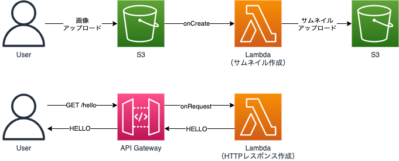

## コンピューティング基礎

ここでは、EC2・ECS・Lambdaといった、アプリケーションを稼働させるコンピューティング部分の知識を整理します。

## EC2

「EC2」とは、仮想サーバーです。
インスタンスを立ち上げる際には、「Amazonマシンイメージ（AMI）」を指定します。
AMIはOSやアプリケーションを含んだテンプレートなので、インスタンスを立ち上げた直後から手早く使い始められます。

インスタンスを立ち上げる際には、「インスタンスタイプ」と呼ばれるCPUやメモリのスペックも指定できます。
インスタンスタイプは様々な種類があり、`t2.medium`・`m5.large`など目的に応じて使い分けられます。

EC2はAMI・インスタンスタイプを指定することができるので、目的に応じてリソースを最適化しやすい形となっています。
ですが、構築するためのコストや、インスタンス内のOSをメンテナンスするコストが発生しやすいといった点もあります。
なので、CPU・メモリ・ディスクなどハードウェアリソースに関して最適化が必要ない一般的なアプリケーションの場合は、EC2ではなくコンテナを利用したECSなどを利用する方が良いでしょう。

## ECS

「Elastic Container Service（ECS）」とは、Dockerコンテナ環境を提供するものです。
EC2の場合はAMI・インスタンスタイプなどを指定してインスタンスを立ち上げましたが、ECSの場合はDockerイメージを元にコンテナを立ち上げられます。

ECSではまず、コンテナを管理するための「Cluster」を作成します。
Dockerイメージ・CPU・メモリといったコンテナを立ち上げるために必要な情報を定義した「Task Definition」も作成します。
そして、ClusterがTask Definitionを元にコンテナを立ち上げてくれます。
この、立ち上がったコンテナのことを「Task」とも表現します。

また、一般的なAPIサーバーなど、実行し続ける形のTaskを「Service」と呼びます。
これは、コンテナを立ち上げる際に、Serviceとして立ち上げるかを指定できます。

これらのコンテナ環境は、実行環境としてEC2・Fargateなどが指定できます。
EC2を選択した場合は、EC2インスタンス自体の管理コストが発生します。
Fargateを選択した場合は、AWS側で自動的に管理されるため、よりアプリケーション開発に注力しやすくなります。

## ELB

「Elastic Load Balancer（ELB）」とは、ロードバランサーです。
HTTP・HTTPS・gRPCといったリクエストレベルで動作する「Application Load Balancer（ALB）」。
TCP・UDP・TLSといったコネクションレベルで動作する「Network Load Balancer（NLB）」。
このような、異なるレイヤーのロードバランサーが提供されています。

ALBを使うことで、HTTPなどを使ったアプリケーションに対するロードバランシングが行えます。
これにより、複数のEC2インスタンスや、複数のコンテナに対してリクエストを分散させられます。

EC2・ECSどちらもリクエスト数に応じて、インスタンス・コンテナを自動的にスケールアウト・スケールインさせられます。
また、SSL証明書を設定し、HTTPSでリクエストを受ける事もできます。

なので、一定以上のリクエストが想定される場合や、HTTPSでリクエストを受けたい場合などは、ALBを使うと良いでしょう。

## Lambda

「Lambda」とは、サーバーレスでイベント駆動型のコンピューティングサービスです。
API Gateway・S3・DynamoDBといったサービスの処理をイベントとして、Lambdaを実行できます。

イベントのたびに都度リソースを確保し実行されるので、リクエスト数に応じて自動的にスケールさせられ、リソース管理コストも低くなります。
ただし、実行時間やファイルサイズなどに制限があるといった特徴もあります。

なので、画像のサムネイル作成・メール送信といった、一定時間内で終わるけど非同期で処理したい、といった場合に活用すると良いでしょう。

## CloudWatch Logs

「CloudWatch Logs」とは、ログ管理サービスです。
様々なリソースのログを保存・閲覧・モニタリングできます。

EC2・ECS・Lambdaなどを始めとした様々なサービス・リソースのログを、CloudWatch Logsへ保存できます。
また、ログの内容に応じてアラームを設定し、不具合などを検知することもできます。

## まとめ

EC2は最も基礎的な仮想サーバーです。
ECSはコンテナ環境を構築するサービスであり、Lambdaはイベント駆動型のサービスです。
これらのコンピューティングサービスを利用してアプリケーションを実行することができ、必要に応じてELBでリクエストをロードバランシングできます。
システム構築を行うにあたり、これらサービスのいずれかを使ってアプリケーションを実行させることになります。
使い分けることでより適切なシステム構築を行えるようになるので、しっかりと理解しておきましょう。

つぎは、アプリケーションで扱うデータを保存するデータベースについて知識を整理していきます。

[AWS データベース基礎](/p/basic-database/)
