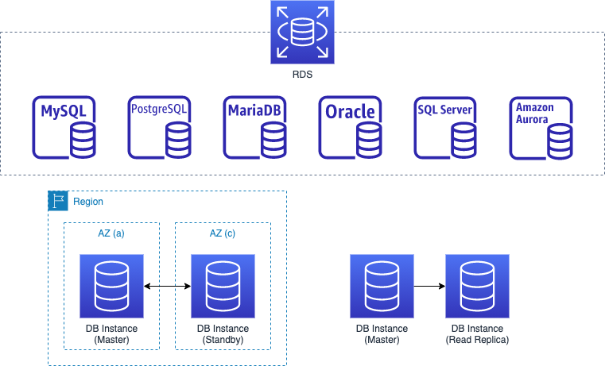
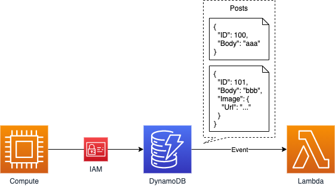
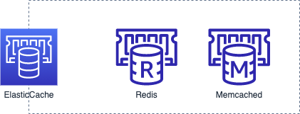
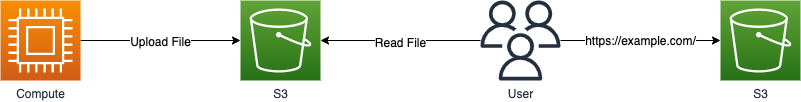

## コンピューティング基礎

ここでは、RDS・DynamoDBといった、アプリケーションで扱うデータを保存する、データベース部分の知識を整理します。

## RDS

「Relational Database Service（RDS）」とは、RDBサービスです。
データベースエンジンとして、MySQL・PostgreSQL・MariaDB・Oracle・SQL Serverに加え、AWS独自の「Aurora」が選択できます。

RDSでは運用に関わる様々な作業がAWS側で行われるようになっていて、EC2上に構築した場合に比べ様々な面でコストを削減できます。
また、複数アベイラビリティゾーンにDBインスタンスを配置したり、リードレプリカを配置するなど、可用性を高める構成を簡単に構築できるようになっています。

複数あるデータベースエンジンの中でも、AuroraはAWS独自のエンジンです。
MySQL・PostgreSQLと互換性を持っているため、同じSQLや接続方法で使うことができます。
標準的なMySQL・PostgreSQLと比べ、パフォーマンスや可用性に関して優れているのが特徴です。

## DynamoDB

「DynamoDB」とは、NoSQLデータベースサービスです。
スキーマレスであり、JSONのような構造化されたデータをKey-Valueで扱います。

DynamoDBは分散型のシステムであり、非常性に可用性の高いサービスとなっています。
また、AWS独自のデータベースということもあり、IAMによるアクセス管理にも対応しています。

Lambdaを実行するためのイベントとして、DynamoDBを設定することもできます。
なので、DynamoDB上のデータが作成・更新・削除されたら、Lambda上で任意の処理を実行する、といった構成も作れます。

ただし、RDBのように異なるデータを関連付けてまとめて取得する、といった使い方は基本的にサポートされていません。
なので、あえてデータを冗長化し、構造化されたデータとして保存しておく、といった考えに切り替える必要がある場合もあります。

## ElasticCache

「ElasticCache」とは、インメモリデータベースサービスです。
エンジンとして、RedisとMemcachedが選択できます。

ElasticCacheでは運用に関わる様々な作業がAWS側で行われるようになっていて、EC2上に構築した場合に比べ様々な面でコストを削減できます。
また、複数ノードを扱ったクラスタなど、可用性を高める構成を簡単に構築できるようになっています。

ストリーミング・セッションストアなど、データの永続性を必要とせず、低レイテンシーな処理を必要とする場面で使えます。

## S3

「Simple Storage Service（S3）」とは、オブジェクトストレージサービスです。
画像・ファイルなど、容量が大きい・長く保存したい、といったデータを扱いやすくなっています。

S3はアプリケーションの裏側で使う形だけではなく、外部から直接参照する形としても使えます。
HTML・CSS・JSなどを保存しWebホスティングとして使ったり、画像・ファイルを保存してブラウザから直接参照する形で使ったりできます。

## まとめ

データベースサービスとして、RDS・DynamoDB・ElasticCacheなどがあります。
また、オブジェクトストレージサービスとしては、S3などがあります。

これらのサービスを利用して、アプリケーションで扱うデータを保存することができます。
システム構築を行うに当たり、データベース・ストレージを使い分けることでより適切なシステム構築を行えるようになるので、しっかりと理解しておきましょう。

つぎは、セキュリティ周りについて知識を整理していきます。

[AWS セキュリティ基礎](/p/basic-security/)
