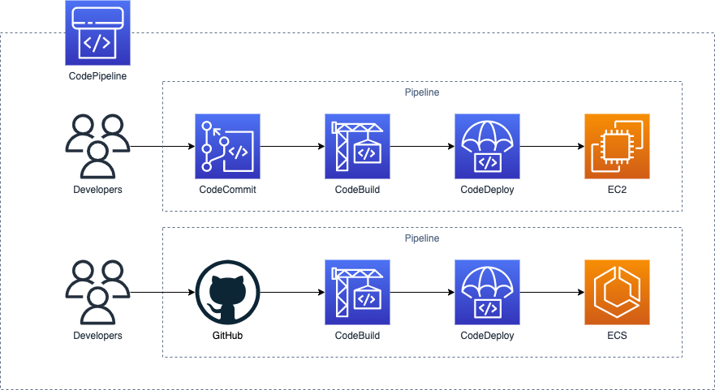
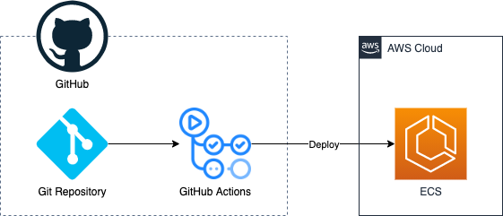
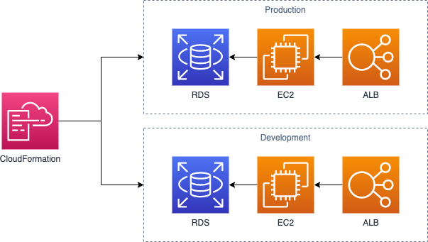
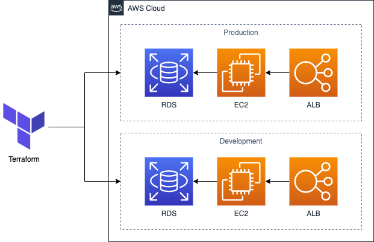

## 開発ツール基礎

ここでは、CodePipeline・CloudFormationといった、開発ツールの知識を整理します。

## CodePipeline

「CodePipline」とは、CI/CDサービスです。
アプリケーションのビルド・テスト・デプロイといったパイプラインを作成できます。

CodePiplineでは、「CodeCommit」「CodeBuild」「CodeDeploy」といったサービスを組み合わせることができます。
CodeCommitからソースコードを取得、CodeBuildでテスト・ビルド、CodeDeployでデプロイといった一連の流れをパイプラインとして作成できます。

これらはAWSのサービスであるため、IAMと連携したり、AWSの様々なサービスへ簡単にデプロイする仕組みが整ってる点はメリットの１つです。

## GitHub Actions

「GitHub Actions」とは、GitHubが提供しているCI/CDサービスです。
GitHub上のソースコードと連携し、アプリケーションのビルド・テスト・デプロイといったワークフローを作成できます。

GitHub ActionsはAWSのサービスではありませんが、AWS CLIなどを通してAWSにデプロイするワークフローを作成できます。
また、ワークフローはソースコード上の定義ファイルを元に作成されるため、アプリケーションに加えてCI/CDを共通のソースコードとして管理できる点はメリットの１つです。

## CloudFormation

「CloudFormation」とは、構成管理サービスです。
AWS上に構築するリソースをモデル化し、反映・管理することができます。

CloudFormationで管理する構成は、YAMLやJSONで記述できます。
また、「AWS CDK」を使うと、プログラミング言語で記述することもできます。

これにより、システム構成をソースコードとして管理することができます。
パラメータを変えて同じ構成のシステム構成を複数作成するといった事も簡単に実施できるようになります。

また、「AWS Copilot」を使うと、パターン化されたシステム構成をより簡単にモデル化し、反映・管理できます。
内部ではCloudFormationが使われていますが、より簡単に扱えるようになっています。

## Terraform

「Terraform」とは、HashiCorpが提供する構成管理サービスです。
TerraformはAWSのサービスではありませんが、AWSを始めとした様々なプラットフォームを含めた構成管理が行えます。

Terraformで管理する構成は、独自の形式で記述できます。
また、パターン化された構成を簡単に再利用できる仕組みがあり、より再利用性や可読性を高めた記述が行なえます。

## まとめ

CodePipelineやGitHub ActionsはCI/CDサービスです。
CloudFormationやTerraformは構成管理サービスです。
これらのサービスを利用することで、アプリケーションをデプロイするまでの流れを自動化でき、それらを含めたシステム構成をモデル化できます。
より効率的に自動化されたシステム構築を行えるようになるので、しっかりと理解しておきましょう。

以上で、AWSを使った実践的なシステム構築を行うために必要な知識の整理は終了です。
それでは、システム構築を実践していきましょう。
