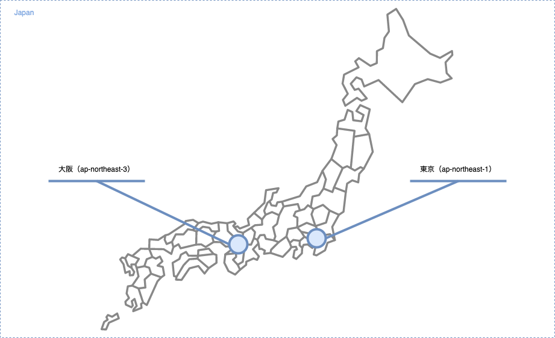
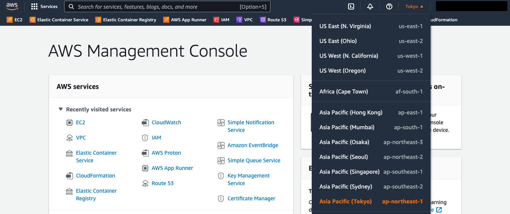
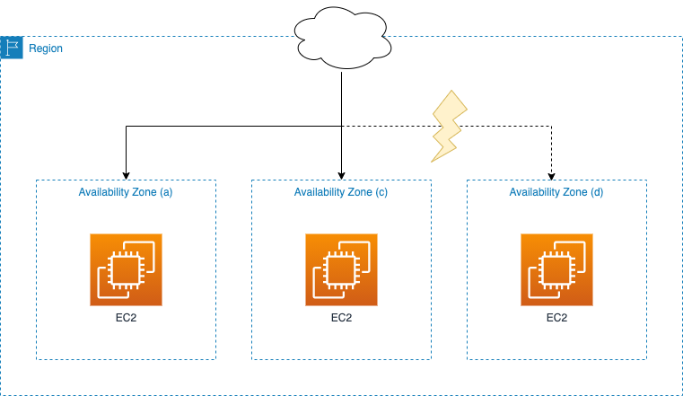
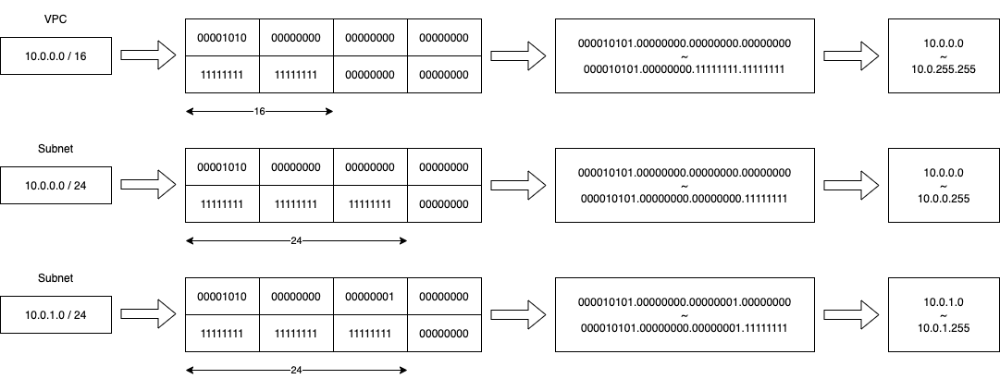
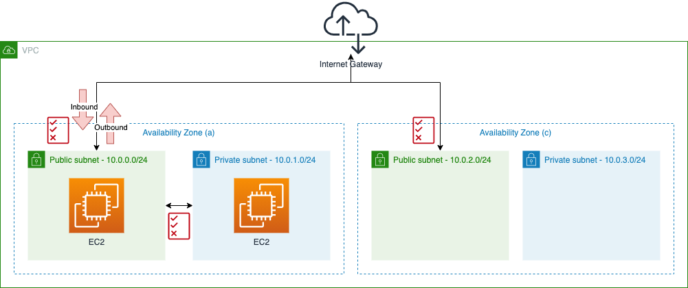

## AWS 実践入門

当サイトでは、AWSを使った実践的なシステム構築を学べる情報を、公開しています。
AWSを学ぶのではなく、AWSを使った実践的なシステム構築を学ぶことを目的としています。

まずは、AWSを使った実践的なシステム構築を行うために必要となる、知識を整理します。

- ネットワーク
- コンピューティング
- ログ
- ストレージ
- データベース
- セキュリティ
- 開発者ツール

それでは、ネットワークから順番に知識を整理していきましょう。

## ネットワーク基礎

ここでは、リージョン・アベイラビリティゾーン・VPCといった、システム構築の基盤となるネットワーク部分の知識を整理します。

## リージョン・アベイラビリティゾーン

「リージョン」とは、AWS上で提供している地域の事を指します。
日本に位置するリージョンとしては、東京（ap-northeast-1）と大阪（ap-northeast-3）の2つがあります。

コンソール画面から現在選択されているリージョンを確認できます。

各リージョンは独立した地域に位置しているため、複数リージョンを扱ったシステム構成にすると、AWS側の障害発生時に影響範囲を小さくできます。ただし、複数リージョンを扱うことで構築・運用などのコストが高まりやすくなる面もあります。そのため、非常に対障害性の高いシステムにする必要があるなど、何かしらの意図を持って複数リージョンを扱うケースが多いでしょう。

「アベイラビリティゾーン（AZ）」とは、各リージョン内に複数存在する独立した場所の事を指します。
各アベイラビリティゾーンも独立した場所に位置するため、複数アベイラビリティゾーンを扱ったシステム構成にすると、AWS側の障害発生時に影響範囲を小さくできます。こちらは、リージョンに比べて複数アベイラビリティゾーンを扱うコストは低いため、手軽に可用性の高いシステムを構築できます。

この様に、複数の地域にリージョンがあり、リージョン内には複数のアベイラビリティゾーンがあります。
複数のリージョンやアベイラビリティゾーンを扱ったシステム構成にすることで、複数の独立した場所に位置するシステム構成となります。
よって、可用性の高いシステムを構築できます。

## VPC

AWSでは「VPC（Virtual Private Cloud）」と呼ばれるネットワークを中心として構築されています。VPCはAWSアカウント内のプライベートなネットワークであり、VPCの中にサーバーやデータベースを配置します。

VPCではIPアドレスの範囲を指定することができ、そのIPをアドレスの範囲を細分化した「サブネット」を作成できます。例えば、VPCの範囲が`10.0.0.0/16`の場合は、`10.0.0.0/24`・`10.0.1.0/24`のような範囲のサブネットを作成できます。

サブネットに対して、「ルートテーブル」つまりルーティングテーブルを設定できます。「インターネットゲートウェイ」をVPCに配置し、ゲートウェイに対するルーティング設定を行うことで、インターネットと通信を行えるようになります。このように、インターネットゲートウェイへのルーティング設定があるサブネットをパブリックサブネット、そうでないサブネットをプライベートサブネットと呼ぶこともあります。

また、VPCやサブネットに対する通信のアクセス制御を「セキュリティグループ」で定義できます。セキュリティグループでは、外部から内部へと通信するインバウンドルールと、内部から外部へ通信するアウトバウンドルールを定義できます。ホワイトリスト形式で、定義されたルールに合致する通信のみ許可されます。

## まとめ

リージョン・アベイラビリティゾーンは異なる地域・場所の事を指します。そして、AWSにおけるネットワークはVPCを中心に構成されています。これらの概念は、AWSでシステム構築を行うにあたって、とても重要なものです。しっかりと理解しておきましょう。

つぎは、アプリケーションの基盤となるコンピューティングについて知識を整理していきます。

[AWS コンピューティング基礎](/p/basic-computing/)
