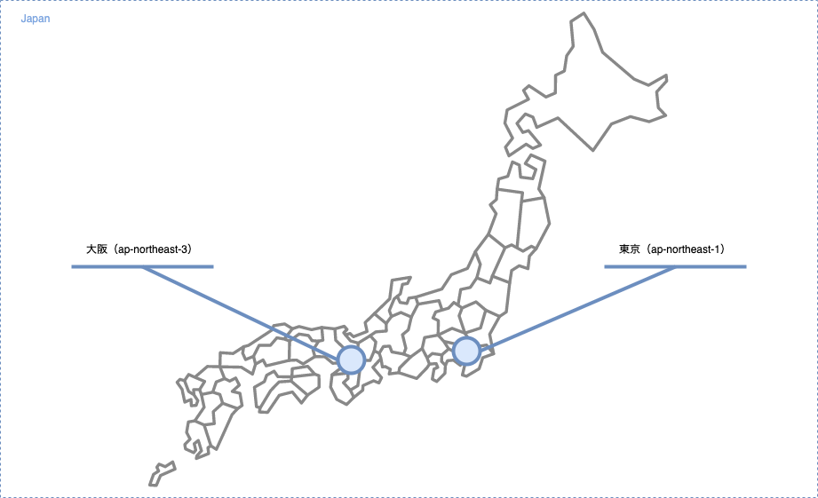
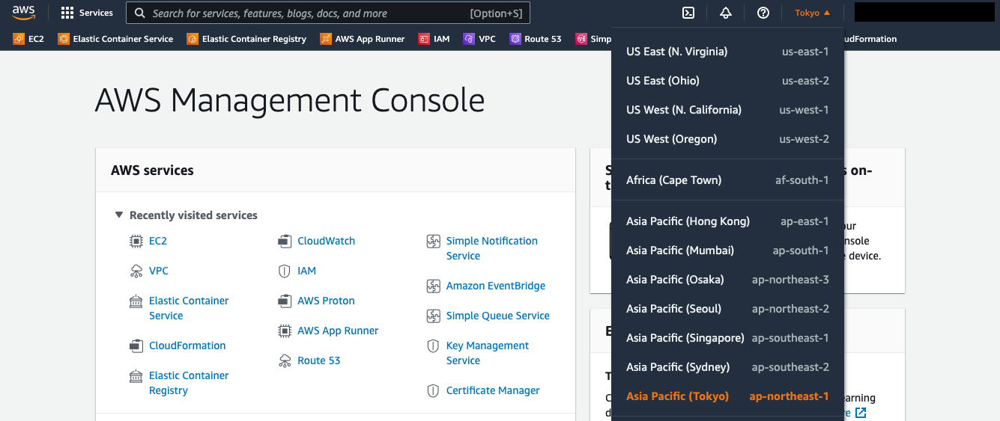
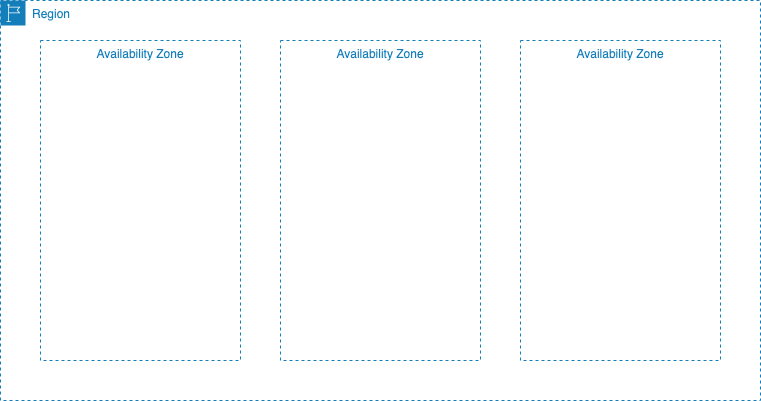

## AWS 実践入門

当サイトでは、AWSを使った実践的なシステム構築を学べる情報を、公開しています。
AWSを学ぶのではなく、AWSを使った実践的なシステム構築を学ぶことを目的としています。
なので、AWSから提供されている全てのサービスを網羅することや、各サービスの基礎的な情報を公開することは、目指していません。

まずは、AWSを使った実践的なシステム構築を行うために必要となる、知識を整理します。

- ネットワーク
- コンピューティング
- ログ
- ストレージ
- データベース
- セキュリティ
- 開発者ツール

それでは、ネットワークから順番に知識を整理していきましょう。

## ネットワーク基礎

ここでは、リージョン・アベイラビリティゾーン・VPCといった、システム構築の基盤となるネットワーク部分の知識を整理します。

## リージョン・アベイラビリティゾーン

「リージョン」とは、AWS上で提供している地域の事を指します。
日本に位置するリージョンとしては、東京（ap-northeast-1）と大阪（ap-northeast-3）の2つがあります。

コンソール画面から現在選択されているリージョンを確認できます。

また、多くのAWSサービスがリージョンを指定して使う形となっています。
そのため、複数リージョンを扱ったシステム構成は、単一リージョンのシステム構成に比べて構築・運用などのコストが高まります。
AWS側の障害発生時にもサービスを継続したい場合など、何かしらの意図を持って複数リージョンを扱うケースが多いでしょう。

「アベイラビリティゾーン」とは、各リージョン内に複数存在する独立した場所の事を指します。
各アベイラビリティゾーンは独立した場所に位置するため、複数アベイラビリティゾーンを扱ったシステム構成にすると、AWS側の障害発生時にも影響範囲を小さくできます。

リージョンに比べアベイラビリティゾーンを複数扱う構成を構築・運用するコストは低くなります。
そのため、複数アベイラビリティゾーンを扱う構成にすることで、手軽に可用性の高いシステムを構築できます。

## VPC

TBD

## まとめ

TBD
