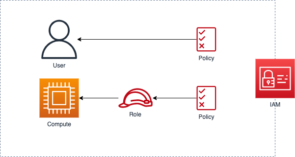
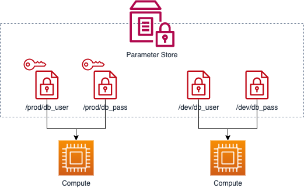

## セキュリティ基礎

ここでは、IAM・Systems Manager Parameter Storeといった、セキュリティ部分の知識を整理します。

## IAM

「Identity and Access Management（IAM）」とは、アクセス制御を行うサービスです。
誰が・どこに・何を・行えるのかを定義し、それを元にアクセスを許可・拒否できます。

アクセス制御の具体的なルールを記述したものが「IAMポリシー」です。
Action・Resource・Effectという3つの要素に基づいて、どこに・何を・行えるのか定義します。

AWS上の各リソースを操作するために「IAMユーザー」を作成できます。
パスワードを発行してAWSコンソールへとアクセスしたり、アクセスキーを発行してAPIリクエストしたりできます。

実行するAWSリソースなど一時的に権限を付与する場合は、「IAMロール」を使います。
IAMロールの中には複数のIAMポリシーが含まれていて、それを元にアクセス制御が行なえます。

この様にIAMを使うことで、各サービス・リソース間のアクセス制御を行えます。
ですが、RDSでMySQLを使う場合など、AWSに依存していない接続方法ではIAMを使えない場合があります。
そのような場合は、VPCのセキュリティグループなどによりアクセスを制限するといった方法を取ることも可能です。

### Systems Manager Parameter Store

「Parameter Store」とは、「Systems Manager」のー機能である設定データ管理サービスです。
パスワード・ライセンスコードなど、任意のデータをKey-Value形式で保存できます。

Parameter Storeに保存する値は、暗号化して保存することも可能です。
また、暗号化せずに保存したとしても、アプリケーションとは切り離された場所で設定データを管理できるのはメリットの１つです。

## まとめ

アクセス制御を行うサービスとして、IAMがあります。
また、設定データを管理するサービスとしては、Parameter Storeがあります。

これらのサービスを利用して、アプリケーションやリソースに対して適切に権限管理・情報管理できます。
システム構築を行うに当たり、これらのサービスを使うことでよりセキュリティを考慮したシステム構築を行えるようになるので、しっかりと理解しておきましょう。

つぎは、セキュリティ周りについて知識を整理していきます。

[AWS セキュリティ基礎](/p/basic-security/)
