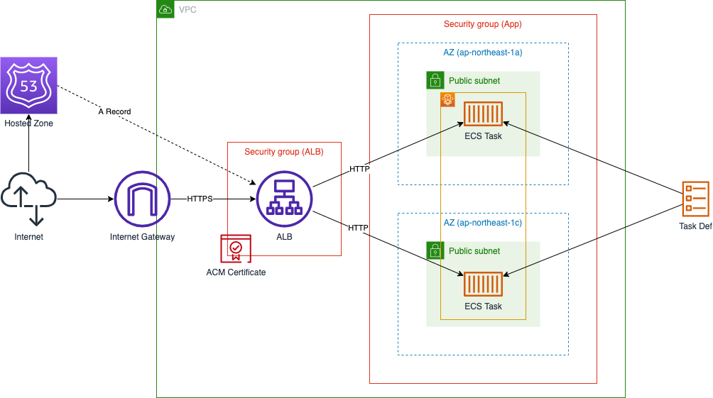
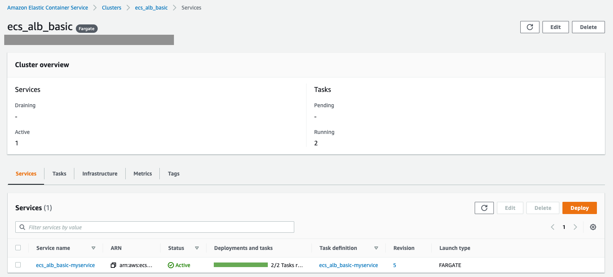

## 作成するシステム構成

ここでは、次のようなシステム構成を構築します。



HTTPSでリクエストを受ける基礎的なWebサーバーの構成です。
インターネットからのHTTPSリクエストをApplication Load Balancerで受け、HTTPリクエストとしてECS Taskへと転送します。
ネットワーク構成としては、２つのAvailability ZoneにそれぞれPublic Subnetを配置し、可用性を高めます。

近年はSSL化していないWebサイトに対して、検索エンジン・Webブラウザが警告を出すようになりました。
そのような状況もあり、インターネットへ公開するWebサーバーは基本的にHTTPSに対応していることが実質的に必須条件となっています。
なので、実際に使われるシステムとしては、HTTPSでリクエストを受けるシステム構成が基礎的な構成であると考えられます。

また、システム構成をコードで管理できるようTerraformを使い構築を進めていきます。
これにより、Production・Developmentといった複数環境に同等の構成を簡単に構築できるようになります。

それでは、順番にシステムの構築を進めていきましょう。


## ネットワーク構築

まずは、VPC・Subnetといったネットワーク部分の構築を進めます。

VPC内に異なるAZとなる２つのPublic Subnetを配置します。
Public SubnetなのでInternetへと通信できるようInternet GatewayをVPCに配置し、Route Tableも設定します。

```tf
terraform {
  required_providers {
    aws = {
      source = "hashicorp/aws"
      version = "~> 3.70.0"
    }
  }
}

locals {
  app_name = "ecs_alb_basic"
  domain_name = "example.practical-aws.dev"
}

provider "aws" {
  region = "ap-northeast-1"
  default_tags {
    tags = {
      application = local.app_name
    }
  }
}

####################################################
# VPC
####################################################

resource "aws_vpc" "this" {
  cidr_block = "10.0.0.0/16"
  tags = {
    Name = "${local.app_name}"
  }
}

####################################################
# Public Subnet
####################################################

resource "aws_internet_gateway" "this" {
  vpc_id = aws_vpc.this.id
  tags = {
    Name = "${local.app_name}"
  }
}

resource "aws_subnet" "public_1" {
  vpc_id = aws_vpc.this.id
  cidr_block = "10.0.1.0/24"
  availability_zone = "ap-northeast-1a"
  tags = {
    Name = "${local.app_name}-public_1"
  }
}

resource "aws_subnet" "public_2" {
  vpc_id = aws_vpc.this.id
  cidr_block = "10.0.2.0/24"
  availability_zone = "ap-northeast-1c"
  tags = {
    Name = "${local.app_name}-public_2"
  }
}

resource "aws_route_table" "public" {
  vpc_id = aws_vpc.this.id
  route {
    cidr_block = "0.0.0.0/0"
    gateway_id = aws_internet_gateway.this.id
  }
  tags = {
    Name = "${local.app_name}-public"
  }
}

resource "aws_route_table_association" "public_1_to_ig" {
  subnet_id = aws_subnet.public_1.id
  route_table_id = aws_route_table.public.id
}

resource "aws_route_table_association" "public_2_to_ig" {
  subnet_id = aws_subnet.public_2.id
  route_table_id = aws_route_table.public.id
}
```

Subnet (public_1)


Subnet (public_2)


これで、ネットワークの構築は完了です。


## SSL証明書

つぎは、HTTPSでリクエストを受けるために必要なSSL証明書を準備します。

ALBでSSL証明書を配信するには、AWS Certificate Manager（ACM）を使います。
証明書を検証するにはDNSとEmailが選択できますが、ここではDNSを使った検証方法とします。

DNSで検証するには、作成したACM Certificateに設定されているDNS情報を、対応するHosted Zoneへと登録します。
正しく登録できていれば、数分以内に検証が完了しステータスが更新されます。

また、Hosted Zoneは、自身でドメインを取得し既に作成されていることとします。

```tf
####################################################
# ACM Certificate
####################################################

data "aws_route53_zone" "https" {
  name = local.domain_name
}

resource "aws_acm_certificate" "https" {
  domain_name = local.domain_name
  validation_method = "DNS"
}

resource "aws_route53_record" "https" {
  for_each = {
    for dvo in aws_acm_certificate.https.domain_validation_options : dvo.domain_name => {
      name = dvo.resource_record_name
      record = dvo.resource_record_value
      type = dvo.resource_record_type
    }
  }
  allow_overwrite = true
  name = each.value.name
  records = [each.value.record]
  ttl = 60
  type = each.value.type
  zone_id = data.aws_route53_zone.https.zone_id
}

resource "aws_acm_certificate_validation" "https" {
  certificate_arn = aws_acm_certificate.https.arn
  validation_record_fqdns = [for record in aws_route53_record.https : record.fqdn]
}
```

ACM Certificate


これで、SSL証明書の準備は完了です。


## ロードバランサ構築

つぎに、ロードバランサの構築を進めます。

Application Load BalancerをVPC内に設置し、HTTPS・HTTPでのリクエストを受け付けます。
準備したSSL証明書をHTTPSリスナーへ設定します。
対応するドメインでALBへとリクエストされるよう、DNSにAレコードも作成します。

また、HTTPでリクエストされた際は、HTTPSへとリダイレクトすることとします。


```tf
####################################################
# Application Load Balancer
####################################################

resource "aws_security_group" "alb" {
  name = "${local.app_name}-alb"
  description = "Security Group for ALB"
  vpc_id = aws_vpc.this.id
  tags = {
    Name = "${local.app_name}-alb"
  }
}

resource "aws_security_group_rule" "alb_from_any_http" {
  security_group_id = aws_security_group.alb.id
  type = "ingress"
  description = "Allow from Any HTTP"
  from_port = 80
  to_port = 80
  protocol = "tcp"
  cidr_blocks = ["0.0.0.0/0"]
}

resource "aws_security_group_rule" "alb_from_any_https" {
  security_group_id = aws_security_group.alb.id
  type = "ingress"
  description = "Allow from Any HTTPS"
  from_port = 443
  to_port = 443
  protocol = "tcp"
  cidr_blocks = ["0.0.0.0/0"]
}

resource "aws_security_group_rule" "alb_to_any" {
  security_group_id = aws_security_group.alb.id
  type = "egress"
  description = "Allow to Any"
  from_port = 0
  to_port = 0
  protocol = "-1"
  cidr_blocks = ["0.0.0.0/0"]
}

resource "aws_lb" "this" {
  name = replace("${local.app_name}", "_", "-")
  load_balancer_type = "application"
  security_groups = [
    aws_security_group.alb.id,
  ]
  subnets = [
    aws_subnet.public_1.id,
    aws_subnet.public_2.id,
  ]
}

resource "aws_lb_listener" "https" {
  load_balancer_arn = aws_lb.this.arn
  port = "443"
  protocol = "HTTPS"
  certificate_arn = aws_acm_certificate.https.arn
  default_action {
    type = "fixed-response"
    fixed_response {
      content_type = "text/plain"
      message_body = "503 Service Temporarily Unavailable"
      status_code = "503"
    }
  }
}

resource "aws_lb_listener" "http" {
  load_balancer_arn = aws_lb.this.arn
  port = "80"
  protocol = "HTTP"
  default_action {
    type = "redirect"
    redirect {
      port = "443"
      protocol = "HTTPS"
      status_code = "HTTP_301"
    }
  }
}

resource "aws_route53_record" "alb" {
  zone_id = data.aws_route53_zone.https.zone_id
  name = local.domain_name
  type = "A"
  alias {
    name = aws_lb.this.dns_name
    zone_id = aws_lb.this.zone_id
    evaluate_target_health = true
  }
}
```

Application Load Balancer


これで、ロードバランサの構築は完了です。


## セキュリティグループ構築

つぎに、VPC内のアプリケーションに設定するセキュリティグループの構築を進めます。

VPC内に複数のアプリケーション、つまり複数のECS Serviceなどを配置した場合を想定します。
この時、ALBからの通信と、複数のアプリケーション間の通信を必要とすることが考えられます。
なので、各アプリケーションに共通のセキュリティグループを適用し、ALB・同セキュリティグループからの通信のみを許可することとします。

```tf
####################################################
# Application Security Group
####################################################

resource "aws_security_group" "app" {
  name = "${local.app_name}-app"
  description = "Security Group for Application"
  vpc_id = aws_vpc.this.id
  tags = {
    Name = "${local.app_name}-app"
  }
}

resource "aws_security_group_rule" "app_from_this" {
  security_group_id = aws_security_group.app.id
  type = "ingress"
  description = "Allow from This"
  from_port = 0
  to_port = 0
  protocol = "-1"
  self = true
}

resource "aws_security_group_rule" "app_from_alb" {
  security_group_id = aws_security_group.app.id
  type = "ingress"
  description = "Allow from ALB"
  from_port = 0
  to_port = 0
  protocol = "-1"
  source_security_group_id = aws_security_group.alb.id
}

resource "aws_security_group_rule" "app_to_any" {
  security_group_id = aws_security_group.app.id
  type = "egress"
  description = "Allow to Any"
  from_port = 0
  to_port = 0
  protocol = "-1"
  cidr_blocks = ["0.0.0.0/0"]
}
```

Security Group


## コンテナサービス構築

最後に、コンテナサービスの構築を進めます。

Elastic Container Serviceを使い、コンテナ環境を作成します。
また、コンテナ実行環境はFargateを使うこととします。

ECS Serviceとして起動させるDockerイメージは、簡単に動作確認できるnginxのイメージを使います。
このイメージを指定して、ECS Task Difinitionを作成します。

ログをCloudWatch Logsへと転送できるよう、ログドライバーにawslogsを指定します。
そのままではCloudWatch Logsへのリクエストが許可されていないので、Task Roleにアクセスポリシーを定義します。

そして、これまで作成したVPC・Subnet・Security Group・ALBなどを指定して、ECS Serviceを作成します。
この時、ALBに設定するHTTPSリスナーは、優先度を高く設定しデフォルトリスナーより先に判定されるようにします。

```tf
####################################################
# ECS Cluster
####################################################

resource "aws_ecs_cluster" "this" {
  name = "${local.app_name}"
  capacity_providers = ["FARGATE"]
  default_capacity_provider_strategy {
    capacity_provider = "FARGATE"
  }
  setting {
    name = "containerInsights"
    value = "enabled"
  }
}

resource "aws_iam_role" "ecs_task_exec" {
  name = "${local.app_name}-ecs_task_exec"
  assume_role_policy = jsonencode({
    Version = "2012-10-17"
    Statement = [
      {
        Effect = "Allow"
        Principal = { Service = "ecs-tasks.amazonaws.com" }
        Action = "sts:AssumeRole"
      }
    ]
  })
  managed_policy_arns = [
    "arn:aws:iam::aws:policy/service-role/AmazonECSTaskExecutionRolePolicy"
  ]
}

####################################################
# ECS Service
####################################################

resource "aws_cloudwatch_log_group" "myservice" {
  name = "${local.app_name}-myservice"
}

resource "aws_iam_role" "myservice_task" {
  name = "${local.app_name}-myservice_task"
  assume_role_policy = jsonencode({
    Version = "2012-10-17"
    Statement = [
      {
        Effect = "Allow"
        Principal = { Service = "ecs-tasks.amazonaws.com" }
        Action = "sts:AssumeRole"
      }
    ]
  })
  inline_policy {
    name = "allow_logs"
    policy = jsonencode({
      Version = "2012-10-17"
      Statement = [
        {
          Effect = "Allow"
          Action = [
            "logs:CreateLogStream",
            "logs:DescribeLogGroups",
            "logs:DescribeLogStreams",
            "logs:PutLogEvents",
          ],
          Resource = "*"
        }
      ]
    })
  }
}

resource "aws_ecs_task_definition" "myservice" {
  family = "${local.app_name}-myservice"
  network_mode = "awsvpc"
  requires_compatibilities = ["FARGATE"]
  cpu = 256
  memory = 512
  execution_role_arn = aws_iam_role.ecs_task_exec.arn
  task_role_arn = aws_iam_role.myservice_task.arn
  container_definitions = jsonencode([{
    name = "nginx"
    image = "public.ecr.aws/docker/library/nginx:latest"
    portMappings = [{ containerPort:80 }]
    logConfiguration = {
      logDriver = "awslogs"
      options = {
        awslogs-region: "ap-northeast-1"
        awslogs-group: aws_cloudwatch_log_group.myservice.name
        awslogs-stream-prefix: "ecs"
      }
    }
  }])
}

resource "aws_ecs_service" "myservice" {
  name = "${local.app_name}-myservice"
  cluster = aws_ecs_cluster.this.id
  platform_version = "LATEST"
  task_definition = aws_ecs_task_definition.myservice.arn
  desired_count = 2
  deployment_minimum_healthy_percent = 100
  deployment_maximum_percent = 200
  propagate_tags = "SERVICE"
  enable_execute_command = true
  launch_type = "FARGATE"
  health_check_grace_period_seconds = 60
  deployment_circuit_breaker {
    enable = true
    rollback = true
  }
  network_configuration {
    assign_public_ip = true
    subnets = [
      aws_subnet.public_1.id,
      aws_subnet.public_2.id,
    ]
    security_groups = [
      aws_security_group.app.id,
    ]
  }
  load_balancer {
    target_group_arn = aws_lb_target_group.myservice.arn
    container_name = "nginx"
    container_port = 80
  }
}

resource "aws_lb_target_group" "myservice" {
  name = replace("${local.app_name}-myservice", "_", "-")
  vpc_id = aws_vpc.this.id
  target_type = "ip"
  port = 80
  protocol = "HTTP"
  deregistration_delay = 60
  health_check { path = "/" }
}

resource "aws_lb_listener_rule" "myservice" {
  listener_arn = aws_lb_listener.https.arn
  priority = 50000
  action {
    type = "forward"
    target_group_arn = aws_lb_target_group.myservice.arn
  }
  condition {
    path_pattern { values = ["/*"] }
  }
}
```

ECS Service



これで、コンテナサービスの構築は完了です。
正しく構築できていれば、設定したドメインでページにアクセスでき、nginxのデフォルトページが表示されるはずです。


# まとめ

HTTPSでリクエストを受ける基礎的なWebサーバーのシステムを構築しました。

インターネットからのHTTPSリクエストをApplication Load Balancerで受け、HTTPリクエストとしてECS Taskへと転送しました。
また、ネットワーク構成としては、２つのAvailability ZoneにそれぞれPublic Subnetを配置し、可用性を高めました。

多くの場合、ECSを扱ったシステムは今回の構成をベースとして拡張していくこととなるでしょう。
データベースとしてRDBを配置したり、サービスディスカバリを設定してマイクロサービス化したり、することもできるでしょう。

基礎となる構成をしっかりと理解して、さらに発展したシステムを構築できるようにしておきましょう。
