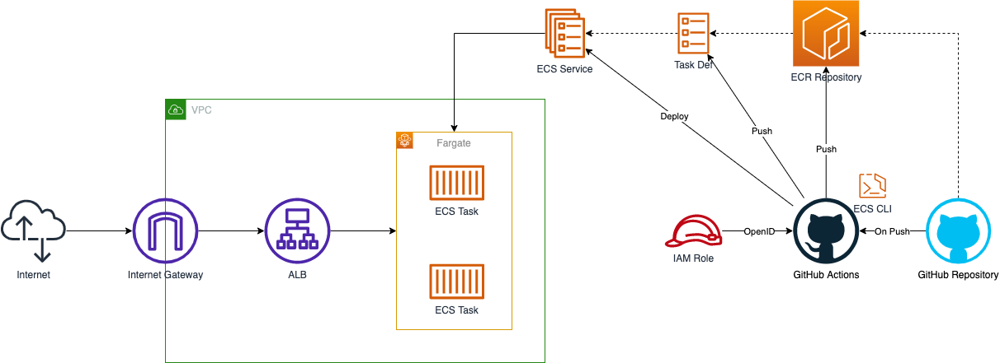
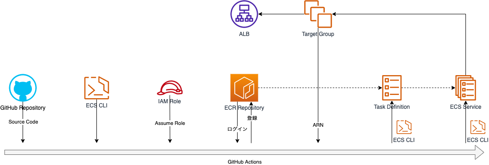
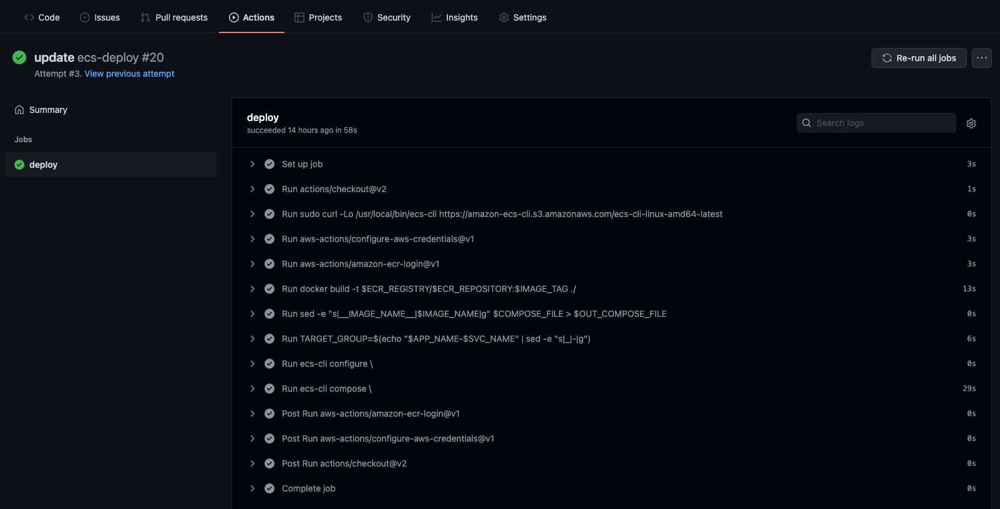

## 作成するシステム構成

ここでは、次のようなシステム構成を構築します。



ALBでリクエスト受けるECS Serviceに対して、GitHub Actionsからデプロイするシステムの構成です。
GitHub Actions上でECR Repository・Task Definition・ECS Serviceを更新します。

ECS Serviceを更新する方法は様々ありますが、ここではECS CLIを使います。
ECS CLIを使うことで、ECS Serviceの構成情報をコード化でき、それらをもとにECS Serviceを更新できます。

GitHub ActionsからAWSにアクセスするためには、必要な権限を持った認証情報を設定する必要があります。
こちらも、方法は複数ありますが、ここではOpenID Connectを使います。
OpenID Connectを使うことで、一定時間で失効する認証情報を保持でき、よりセキュアな構成にできます。

また、システム構成をコードで管理できるようTerraformを使い構築を進めていきます。
これにより、Production・Developmentといった複数環境に同等の構成を簡単に構築できるようになります。

それでは、順番にシステムの構築を進めていきましょう。


## ネットワーク構築

まずは、VPC・Subnetといったネットワーク部分の構築を進めます。

VPC内に異なるAZとなる２つのPublic Subnetを配置します。
Public SubnetなのでInternetへと通信できるようInternet GatewayをVPCに配置し、Route Tableも設定します。

```tf
terraform {
  required_providers {
    aws = {
      source = "hashicorp/aws"
      version = "~> 3.70.0"
    }
  }
}

locals {
  app_name = "ecs_deploy_gh_actions"
  gh_org_name = "umatoma"
}

provider "aws" {
  region = "ap-northeast-1"
  default_tags {
    tags = {
      application = local.app_name
    }
  }
}

####################################################
# VPC
####################################################

resource "aws_vpc" "this" {
  cidr_block = "10.0.0.0/16"
  enable_dns_support = true
  enable_dns_hostnames = true
  tags = {
    Name = "${local.app_name}"
  }
}

####################################################
# Public Subnet
####################################################

resource "aws_internet_gateway" "this" {
  vpc_id = aws_vpc.this.id
  tags = {
    Name = "${local.app_name}"
  }
}

resource "aws_subnet" "public_1" {
  vpc_id = aws_vpc.this.id
  cidr_block = "10.0.1.0/24"
  availability_zone = "ap-northeast-1a"
  tags = {
    Name = "${local.app_name}-public_1"
  }
}

resource "aws_subnet" "public_2" {
  vpc_id = aws_vpc.this.id
  cidr_block = "10.0.2.0/24"
  availability_zone = "ap-northeast-1c"
  tags = {
    Name = "${local.app_name}-public_2"
  }
}

resource "aws_route_table" "public" {
  vpc_id = aws_vpc.this.id
  route {
    cidr_block = "0.0.0.0/0"
    gateway_id = aws_internet_gateway.this.id
  }
  tags = {
    Name = "${local.app_name}-public"
  }
}

resource "aws_route_table_association" "public_1_to_ig" {
  subnet_id = aws_subnet.public_1.id
  route_table_id = aws_route_table.public.id
}

resource "aws_route_table_association" "public_2_to_ig" {
  subnet_id = aws_subnet.public_2.id
  route_table_id = aws_route_table.public.id
}
```

これで、ネットワークの構築は完了です。


## ロードバランサ構築

つぎに、ロードバランサの構築を進めます。

Application Load BalancerをVPC内に設置し、HTTPでのリクエストを受け付けます。
実際にはHTTPSでもリクエストを受けると思いますが、ここではHTTPのみ扱うこととします。

```tf
####################################################
# Application Load Balancer
####################################################

resource "aws_security_group" "alb" {
  name = "${local.app_name}-alb"
  description = "Security Group for ALB"
  vpc_id = aws_vpc.this.id
  tags = {
    Name = "${local.app_name}-alb"
  }
}

resource "aws_security_group_rule" "alb_from_any_http" {
  security_group_id = aws_security_group.alb.id
  type = "ingress"
  description = "Allow from Any HTTP"
  from_port = 80
  to_port = 80
  protocol = "tcp"
  cidr_blocks = ["0.0.0.0/0"]
}

resource "aws_security_group_rule" "alb_to_any" {
  security_group_id = aws_security_group.alb.id
  type = "egress"
  description = "Allow to Any"
  from_port = 0
  to_port = 0
  protocol = "-1"
  cidr_blocks = ["0.0.0.0/0"]
}

resource "aws_lb" "this" {
  name = replace("${local.app_name}", "_", "-")
  load_balancer_type = "application"
  security_groups = [
    aws_security_group.alb.id,
  ]
  subnets = [
    aws_subnet.public_1.id,
    aws_subnet.public_2.id,
  ]
}

resource "aws_lb_listener" "http" {
  load_balancer_arn = aws_lb.this.arn
  port = "80"
  protocol = "HTTP"
  default_action {
    type = "fixed-response"
    fixed_response {
      content_type = "text/plain"
      message_body = "503 Service Temporarily Unavailable"
      status_code = "503"
    }
  }
}
```

これで、ロードバランサの構築は完了です。


## セキュリティグループ構築

つぎに、VPC内のアプリケーションに設定するセキュリティグループの構築を進めます。

VPC内に複数のアプリケーション、つまり複数のECS Serviceなどを配置した場合を想定します。
この時、ALBからの通信と、複数のアプリケーション間の通信を必要とすることが考えられます。
なので、各アプリケーションに共通のセキュリティグループを適用し、ALB・同セキュリティグループからの通信のみを許可することとします。

```tf
####################################################
# Application Security Group
####################################################

resource "aws_security_group" "app" {
  name = "${local.app_name}-app"
  description = "Security Group for Application"
  vpc_id = aws_vpc.this.id
  tags = {
    Name = "${local.app_name}-app"
  }
}

resource "aws_security_group_rule" "app_from_this" {
  security_group_id = aws_security_group.app.id
  type = "ingress"
  description = "Allow from This"
  from_port = 0
  to_port = 0
  protocol = "-1"
  self = true
}

resource "aws_security_group_rule" "app_from_alb" {
  security_group_id = aws_security_group.app.id
  type = "ingress"
  description = "Allow from ALB"
  from_port = 0
  to_port = 0
  protocol = "-1"
  source_security_group_id = aws_security_group.alb.id
}

resource "aws_security_group_rule" "app_to_any" {
  security_group_id = aws_security_group.app.id
  type = "egress"
  description = "Allow to Any"
  from_port = 0
  to_port = 0
  protocol = "-1"
  cidr_blocks = ["0.0.0.0/0"]
}
```

これで、セキュリティグループの構築は完了です。


## コンテナサービス構築

つぎに、コンテナサービスの構築を進めます。

Elastic Container Serviceを使い、コンテナ環境を作成します。
また、コンテナ実行環境はFargateを使うこととします。

Task Definition・ECS Serviceはデプロイパイプラインから構築・更新します。
なので、ここではECS ClusterとECS Serviceで使うIAM Role・Target Group・ECR Repositoryなどを作成します。

CloudWatch Logsにログを転送できるよう、IAM RoleにCloudWatch Logsのポリシーを定義します。
ただし、LogGroupはデプロイパイプライン上で作成します。

```tf
####################################################
# ECS Cluster
####################################################

resource "aws_ecs_cluster" "this" {
  name = "${local.app_name}"
  capacity_providers = ["FARGATE"]
  default_capacity_provider_strategy {
    capacity_provider = "FARGATE"
  }
  setting {
    name = "containerInsights"
    value = "enabled"
  }
}

resource "aws_iam_role" "ecs_task_exec" {
  name = "${local.app_name}-ecs_task_exec"
  assume_role_policy = jsonencode({
    Version = "2012-10-17"
    Statement = [
      {
        Effect = "Allow"
        Principal = { Service = "ecs-tasks.amazonaws.com" }
        Action = "sts:AssumeRole"
      }
    ]
  })
  managed_policy_arns = [
    "arn:aws:iam::aws:policy/service-role/AmazonECSTaskExecutionRolePolicy"
  ]
}

####################################################
# ECS Service
####################################################

resource "aws_iam_role" "myservice_task" {
  name = "${local.app_name}-myservice_task"
  assume_role_policy = jsonencode({
    Version = "2012-10-17"
    Statement = [
      {
        Effect = "Allow"
        Principal = { Service = "ecs-tasks.amazonaws.com" }
        Action = "sts:AssumeRole"
      }
    ]
  })
  inline_policy {
    name = "allow_logs"
    policy = jsonencode({
      Version = "2012-10-17"
      Statement = [
        {
          Effect = "Allow"
          Action = [
            "logs:CreateLogStream",
            "logs:DescribeLogGroups",
            "logs:DescribeLogStreams",
            "logs:PutLogEvents",
          ],
          Resource = "*"
        }
      ]
    })
  }
}

resource "aws_lb_target_group" "myservice" {
  name = replace("${local.app_name}-myservice", "_", "-")
  vpc_id = aws_vpc.this.id
  target_type = "ip"
  port = 80
  protocol = "HTTP"
  deregistration_delay = 60
  health_check { path = "/" }
}

resource "aws_lb_listener_rule" "myservice" {
  listener_arn = aws_lb_listener.http.arn
  priority = 50000
  action {
    type = "forward"
    target_group_arn = aws_lb_target_group.myservice.arn
  }
  condition {
    path_pattern { values = ["/*"] }
  }
}

####################################################
# ECR Repository
####################################################

resource "aws_ecr_repository" "myservice" {
  name = "${local.app_name}-myservice"
  image_tag_mutability = "MUTABLE"
}
```

これで、コンテナサービスの構築は完了です。


## デプロイパイプライン構築

最後に、デプロイパイプラインの構築を進めます。

GitHub Actionsを使ったデプロイパイプラインとして、次のような処理を行います。

- ソースコード 取得
- ECS CLI インストール
- IAM 認証情報 取得
- ECR Private Repository ログイン
- Docker Image ビルド・登録
- Docker Compose ファイル生成
- Target Group 取得
- ECS CLI クラスター設定
- Task Definition・ECS Service 作成・更新



まず、GitHub Actions上でAWSにアクセスするための、IAM Roleを作成します。
GitHub Actionsと連携するためのOpenID Connect Providerを作成し、ECR・ECS・ALBに関するポリシーを定義したIAM Roleを作成します。
ここではアクセス許可するリソースに細かい制限は入れませんが、必要に応じて対象のリソースを制限すると、より必要最低限の権限になるでしょう。

```tf
####################################################
# GitHub Actions
####################################################

resource "aws_iam_openid_connect_provider" "gh_actions" {
  url = "https://token.actions.githubusercontent.com"
  client_id_list = ["sts.amazonaws.com"]
  thumbprint_list = ["a031c46782e6e6c662c2c87c76da9aa62ccabd8e"]
}

resource "aws_iam_role" "gh_actions" {
  name = "${local.app_name}-gh_actions"
  assume_role_policy = jsonencode({
    Version = "2012-10-17"
    Statement = [
      {
        Effect = "Allow"
        Principal = {
          Federated = aws_iam_openid_connect_provider.gh_actions.arn
        }
        Action = "sts:AssumeRoleWithWebIdentity"
        Condition = {
          StringLike = {
            "token.actions.githubusercontent.com:sub": "repo:${local.gh_org_name}/*:*"
          }
        }
      }
    ]
  })
  inline_policy {
    name = "allow_ecr"
    policy = jsonencode({
      Version = "2012-10-17"
      Statement = [
        {
          Effect = "Allow"
          Action = [
            "ecr:GetAuthorizationToken",
            "ecr:GetDownloadUrlForLayer",
            "ecr:BatchGetImage",
            "ecr:CompleteLayerUpload",
            "ecr:UploadLayerPart",
            "ecr:InitiateLayerUpload",
            "ecr:BatchCheckLayerAvailability",
            "ecr:PutImage",
          ]
          Resource = "*"
        }
      ]
    })
  }
  inline_policy {
    name = "allow_ecs"
    policy = jsonencode({
      Version = "2012-10-17"
      Statement = [
        {
          Effect = "Allow"
          Action = [
            "ecs:*",
            "elasticloadbalancing:ModifyListener",
            "elasticloadbalancing:DescribeListeners",
            "elasticloadbalancing:ModifyRule",
            "elasticloadbalancing:DescribeTargetGroups",
            "elasticloadbalancing:DescribeRules",
            "logs:CreateLogGroup",
            "tag:TagResources"
          ]
          Resource = "*"
        },
        {
          Effect = "Allow"
          Action = "iam:PassRole"
          Resource = "*"
          Condition = {
            StringLike = {
              "iam:PassedToService": "ecs-tasks.amazonaws.com"
            }
          }
        }
      ]
    })
  }
}
```

次に、デプロイするDocker Imageの元となる、Dockerfileを作成します。
HTTPで通信できていることが確認できれば良いので、nginxのイメージを使います。

Dockerfile

```Dockerfile
FROM public.ecr.aws/docker/library/nginx:latest
```

次に、デプロイするTask DefinitionとECS Serviceの元となる、docker-compose.yml・ecs-params.ymlを作成します。
ECS CLIでは、docker-compose.yml・ecs-params.ymlを元にTask Definition・ECS Serviceを作成・更新できます。

docker-compose.yml内のイメージ名は、パイプライン上で上書きするため適当な値を設定しておきます。
また、ecs-params.ymlには、事前に作成したSubnet・SecurityGroupのID・IAM Roleなどを設定しておきます。

docker-compose.yml
```yaml
version: "3"
services:
  main:
    image: __IMAGE_NAME__
    ports: ["80:80"]
    logging:
      driver: awslogs
      options:
        awslogs-region: ap-northeast-1
        awslogs-group: /ecs_deploy_gh_actions/myservice
        awslogs-stream-prefix: ecs
```

ecs-params.yml
```yaml
version: 1
task_definition:
  ecs_network_mode: awsvpc
  task_execution_role: ecs_deploy_gh_actions-ecs_task_exec
  task_role_arn: ecs_deploy_gh_actions-myservice_task
  task_size:
    cpu_limit: 256
    mem_limit: 512
run_params:
  network_configuration:
    awsvpc_configuration:
      subnets:
        - subnet-0da81e0bd54600e35
        - subnet-0c6b6e9244654f9dc
      security_groups:
        - sg-0f7e24b161d479ad1
      assign_public_ip: ENABLED
```


次に、パイプラインとして、GitHub ActionsのWorkflowを作成します。

必要な準備は完了しているので、一連の処理を記述します。
AWSのアカウントIDは、自身のIDへと差し替えてください。

.github/workflows/ecs-deploy.yml

```yaml
name: ecs-deploy
on: [push]
jobs:
  deploy:
    runs-on: ubuntu-20.04
    permissions:
      contents: read
      id-token: write
    env:
      ACCOUNT_ID: 111111111111
      REGION: ap-northeast-1
      ACTION_ROLE: ecs_deploy_gh_actions-gh_actions
      APP_NAME: ecs_deploy_gh_actions
      SVC_NAME: myservice
      SVC_COMPOSE_FILE: docker-compose.yml
      SVC_ECS_PARAMS: ecs-params.yml
      SVC_CONTAINER_NAME: main
      SVC_CONTAINER_PORT: 80
    steps:
      - uses: actions/checkout@v2
      - run: |
          sudo curl -Lo /usr/local/bin/ecs-cli https://amazon-ecs-cli.s3.amazonaws.com/ecs-cli-linux-amd64-latest
          sudo chmod +x /usr/local/bin/ecs-cli
      - uses: aws-actions/configure-aws-credentials@v1
        with:
          role-to-assume: arn:aws:iam::${{ env.ACCOUNT_ID }}:role/${{ env.APP_NAME }}-gh_actions
          aws-region: ${{ env.REGION }}
      - id: login-ecr
        uses: aws-actions/amazon-ecr-login@v1
      - id: build-image
        run: |
          docker build -t $ECR_REGISTRY/$ECR_REPOSITORY:$IMAGE_TAG ./
          docker push $ECR_REGISTRY/$ECR_REPOSITORY:$IMAGE_TAG
          echo "::set-output name=image::$ECR_REGISTRY/$ECR_REPOSITORY:$IMAGE_TAG"
        env:
          ECR_REGISTRY: ${{ steps.login-ecr.outputs.registry }}
          ECR_REPOSITORY: ${{ env.APP_NAME }}-${{ env.SVC_NAME }}
          IMAGE_TAG: ${{ github.sha }}
      - id: compose-file
        run: |
          sed -e "s|__IMAGE_NAME__|$IMAGE_NAME|g" $COMPOSE_FILE > $OUT_COMPOSE_FILE
          echo "::set-output name=file::$OUT_COMPOSE_FILE"
        env:
          IMAGE_NAME: ${{ steps.build-image.outputs.image }}
          COMPOSE_FILE: ${{ env.SVC_COMPOSE_FILE }}
          OUT_COMPOSE_FILE: deploy.docker-compose.yml
      - id: target-group
        run: |
          TARGET_GROUP=$(echo "$APP_NAME-$SVC_NAME" | sed -e "s|_|-|g")
          TARGET_GROUP_ARN=$(aws elbv2 describe-target-groups --names $TARGET_GROUP | jq ".TargetGroups[0].TargetGroupArn" --raw-output)
          echo "::set-output name=arn::$TARGET_GROUP_ARN"
      - run: |
          ecs-cli configure \
            --region $REGION \
            --default-launch-type FARGATE \
            --cluster $CLUSTER \
            --config-name $CLUSTER
        env:
          CLUSTER: ${{ env.APP_NAME }}
      - run: |
          ecs-cli compose \
            --cluster $CLUSTER \
            --project-name $PROJECT_NAME \
            --file $COMPOSE_FILE \
            --ecs-params $ECS_PARAMS \
          service up \
            --target-groups "targetGroupArn=$TARGET_GROUP_ARN,containerName=$CONTAINER_NAME,containerPort=$CONTAINER_PORT" \
            --tags "application=$APP_NAME" \
            --create-log-groups \
            --force-deployment
        env:
          CLUSTER: ${{ env.APP_NAME }}
          PROJECT_NAME: ${{ env.APP_NAME }}-${{ env.SVC_NAME }}
          COMPOSE_FILE: ${{ steps.compose-file.outputs.file }}
          ECS_PARAMS: ${{ env.SVC_ECS_PARAMS }}
          TARGET_GROUP_ARN: ${{ steps.target-group.outputs.arn }}
          CONTAINER_NAME: ${{ env.SVC_CONTAINER_NAME }}
          CONTAINER_PORT: ${{ env.SVC_CONTAINER_PORT }}
```

任意のブランチにPushされるとWorkflowが起動されるので、一連のファイルを含めてGitHub RepositoryへPushします。

```bash
$ tree -a .
.
├── .github
│   └── workflows
│       └── ecs-deploy.yml
├── Dockerfile
├── docker-compose.yml
└── ecs-params.yml
```

正しく構築できていれば、Workflowが正常に終了し、ALB経由でnginxのデフォルトページが確認できるはずです。




## まとめ

ALBでリクエスト受けるECS Serviceに対して、GitHub Actionsからデプロイするシステムを構築しました。

GitHub Actions上でECS CLIを使い、Task Definition・ECS Serviceを作成・更新しました。
また、OpenID Connectを使い、認証情報を長期間保持することを避けました。

GitHub Actionsは、GitHubが提供しているCI/CDサービスです。
GitHub上のソースコードと連携し、アプリケーションのビルド・テスト・デプロイといったWorkflowを作成できます。
Workflowはソースコード上の定義ファイルを元に作成されるため、アプリケーションに加えてCI/CDを共通のソースコードとして管理できる点はメリットの１つです。

また、AWSのCI/CDサービスとしてCodePipelineがあります。
CodePipelineを使うことでも、同等の処理を実現することができます。
なので、パイプラインを含めてAWS内に構築したい場合などは、CodePipelineを使ってシステムを構築するのも良いでしょう。

頻繁に更新されるアプリケーションにおいて、デプロイパイプラインの構築は重要な要素の１つです。
より頻繁に手軽にアプリケーションをデプロイできるよう、しっかりと理解しておきましょう。
