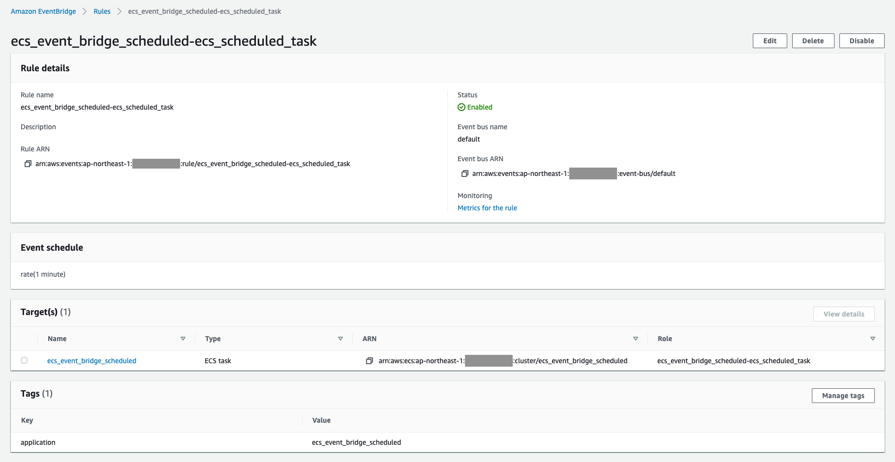

## 作成するシステム構成

ここでは、次のようなシステム構成を構築します。


cronのように指定したスケジュールで処理を実行するシステム構成です。
EventBridgeを使い、指定したスケジュールでイベントを発行します。
発行されたイベントの処理としてECS Taskを起動させることで、cronのようなスケジュール処理を実現します。

ECSを使ったアプリケーション環境を構築する場合、状況に応じてスケールアウト・インすることになります。
つまり、起動するコンテナ数が可変になり、アプリケーションと同じコンテナ内でスケジュール処理することが難しくなります。
そのような場合に、EventBridgeとECS Taskを組み合わせることで、独立したスケジュール処理環境が構築できます。

ECS TaskではなくLambdaを使うことでも簡単にスケジュール処理が行えます。
用途によって良し悪しは異なってきますが、ECS Taskを使ったスケジュール処理の場合は、Dockerイメージ点はメリットの１つです。

また、システム構成をコードで管理できるようTerraformを使い構築を進めていきます。
これにより、Production・Developmentといった複数環境に同等の構成を簡単に構築できるようになります。

それでは、順番にシステムの構築を進めていきましょう。


## ネットワーク構築

まずは、VPC・Subnetといったネットワーク部分の構築を進めます。

VPC内に異なるAZとなる２つのPublic Subnetを配置します。
Public SubnetなのでInternetへと通信できるようInternet GatewayをVPCに配置し、Route Tableも設定します。

```tf
terraform {
  required_providers {
    aws = {
      source = "hashicorp/aws"
      version = "~> 3.70.0"
    }
  }
}

locals {
  app_name = "ecs_event_bridge_scheduled"
}

provider "aws" {
  region = "ap-northeast-1"
  default_tags {
    tags = {
      application = local.app_name
    }
  }
}

####################################################
# VPC
####################################################

resource "aws_vpc" "this" {
  cidr_block = "10.0.0.0/16"
  enable_dns_support = true
  enable_dns_hostnames = true
  tags = {
    Name = "${local.app_name}"
  }
}

####################################################
# Public Subnet
####################################################

resource "aws_internet_gateway" "this" {
  vpc_id = aws_vpc.this.id
  tags = {
    Name = "${local.app_name}"
  }
}

resource "aws_subnet" "public_1" {
  vpc_id = aws_vpc.this.id
  cidr_block = "10.0.1.0/24"
  availability_zone = "ap-northeast-1a"
  tags = {
    Name = "${local.app_name}-public_1"
  }
}

resource "aws_subnet" "public_2" {
  vpc_id = aws_vpc.this.id
  cidr_block = "10.0.2.0/24"
  availability_zone = "ap-northeast-1c"
  tags = {
    Name = "${local.app_name}-public_2"
  }
}

resource "aws_route_table" "public" {
  vpc_id = aws_vpc.this.id
  route {
    cidr_block = "0.0.0.0/0"
    gateway_id = aws_internet_gateway.this.id
  }
  tags = {
    Name = "${local.app_name}-public"
  }
}

resource "aws_route_table_association" "public_1_to_ig" {
  subnet_id = aws_subnet.public_1.id
  route_table_id = aws_route_table.public.id
}

resource "aws_route_table_association" "public_2_to_ig" {
  subnet_id = aws_subnet.public_2.id
  route_table_id = aws_route_table.public.id
}
```

これで、ネットワークの構築は完了です。


## セキュリティグループ構築

つぎに、VPC内のアプリケーションに設定するセキュリティグループの構築を進めます。

VPC内の各ECS Service・Taskに共通のセキュリティグループを適用し、同セキュリティグループからの通信を許可することとします。

```tf
####################################################
# Application Security Group
####################################################

resource "aws_security_group" "app" {
  name = "${local.app_name}-app"
  description = "Security Group for Application"
  vpc_id = aws_vpc.this.id
  tags = {
    Name = "${local.app_name}-app"
  }
}

resource "aws_security_group_rule" "app_from_this" {
  security_group_id = aws_security_group.app.id
  type = "ingress"
  description = "Allow from This"
  from_port = 0
  to_port = 0
  protocol = "-1"
  self = true
}

resource "aws_security_group_rule" "app_to_any" {
  security_group_id = aws_security_group.app.id
  type = "egress"
  description = "Allow to Any"
  from_port = 0
  to_port = 0
  protocol = "-1"
  cidr_blocks = ["0.0.0.0/0"]
}
```

これで、セキュリティグループの構築は完了です。


## コンテナ環境構築

つぎに、コンテナ環境の構築を進めます。

ECS Taskして起動させるDockerイメージは、Hello Worldイメージを使います。
このイメージを指定して、ECS Task Difinitionを作成します。

```tf
####################################################
# ECS Cluster
####################################################

resource "aws_ecs_cluster" "this" {
  name = "${local.app_name}"
  capacity_providers = ["FARGATE"]
  default_capacity_provider_strategy {
    capacity_provider = "FARGATE"
  }
  setting {
    name = "containerInsights"
    value = "enabled"
  }
}

resource "aws_iam_role" "ecs_task_exec" {
  name = "${local.app_name}-ecs_task_exec"
  assume_role_policy = jsonencode({
    Version = "2012-10-17"
    Statement = [
      {
        Effect = "Allow"
        Principal = { Service = "ecs-tasks.amazonaws.com" }
        Action = "sts:AssumeRole"
      }
    ]
  })
  managed_policy_arns = [
    "arn:aws:iam::aws:policy/service-role/AmazonECSTaskExecutionRolePolicy"
  ]
}

####################################################
# ECS Task Definition
####################################################

resource "aws_cloudwatch_log_group" "ecs_task" {
  name = "${local.app_name}-ecs_task"
}

resource "aws_iam_role" "ecs_task" {
  name = "${local.app_name}-ecs_task"
  assume_role_policy = jsonencode({
    Version = "2012-10-17"
    Statement = [
      {
        Effect = "Allow"
        Principal = { Service = "ecs-tasks.amazonaws.com" }
        Action = "sts:AssumeRole"
      }
    ]
  })
  inline_policy {
    name = "allow_logs"
    policy = jsonencode({
      Version = "2012-10-17"
      Statement = [
        {
          Effect = "Allow"
          Action = [
            "logs:CreateLogStream",
            "logs:DescribeLogGroups",
            "logs:DescribeLogStreams",
            "logs:PutLogEvents",
          ],
          Resource = "*"
        }
      ]
    })
  }
}

resource "aws_ecs_task_definition" "ecs_task" {
  family = "${local.app_name}-ecs_task"
  network_mode = "awsvpc"
  requires_compatibilities = ["FARGATE"]
  cpu = 256
  memory = 512
  execution_role_arn = aws_iam_role.ecs_task_exec.arn
  task_role_arn = aws_iam_role.ecs_task.arn
  container_definitions = jsonencode([{
    name = "main"
    image = "public.ecr.aws/docker/library/hello-world:latest"
    portMappings = []
    logConfiguration = {
      logDriver = "awslogs"
      options = {
        awslogs-region: "ap-northeast-1"
        awslogs-group: aws_cloudwatch_log_group.ecs_task.name
        awslogs-stream-prefix: "ecs"
      }
    }
  }])
}
```


## スケジュール処理構築

最後に、スケジュール処理の構築を進めます。

指定したスケジュールでイベントを発行するため、EventBridgeにRuleを登録します。
動作が確認しやすいよう、ここでは１分毎（`rate(1 minute)`）にイベントを発行することとします。

発行されたイベントの処理として、先程作成したTask Definitionを元に、ECS Taskを起動します。
これにより、１分毎にECS Taskを起動し、処理を実行できます。

```tf
##################################################
# EventBridge
##################################################

resource "aws_iam_role" "ecs_scheduled_task" {
  name = "${local.app_name}-ecs_scheduled_task"
  assume_role_policy = jsonencode({
    Version = "2012-10-17"
    Statement = [
      {
        Effect = "Allow"
        Principal = { Service = "events.amazonaws.com" }
        Action = "sts:AssumeRole"
      }
    ]
  })
  inline_policy {
    name = "allow_pass_role"
    policy = jsonencode({
      Version = "2012-10-17"
      Statement = [
        {
          Effect = "Allow"
          Action = "iam:PassRole"
          Resource = [
            aws_iam_role.ecs_task_exec.arn,
            aws_iam_role.ecs_task.arn,
          ]
        }
      ]
    })
  }
  inline_policy {
    name = "allo_run_task"
    policy = jsonencode({
      Version = "2012-10-17"
      Statement = [
        {
          Effect = "Allow"
          Action = "ecs:RunTask"
          Resource = aws_ecs_task_definition.ecs_task.arn
          Condition = {
            ArnEquals = {
              "ecs:cluster": aws_ecs_cluster.this.arn
            }
          }
        }
      ]
    })
  }
}

resource "aws_cloudwatch_event_rule" "ecs_scheduled_task" {
  name = "${local.app_name}-ecs_scheduled_task"
  schedule_expression = "rate(1 minute)"
}

resource "aws_cloudwatch_event_target" "ecs_scheduled_task" {
  target_id = "ecs_scheduled_task"
  rule = aws_cloudwatch_event_rule.ecs_scheduled_task.name
  role_arn = aws_iam_role.ecs_scheduled_task.arn
  arn = aws_ecs_cluster.this.arn
  ecs_target {
    task_definition_arn = aws_ecs_task_definition.ecs_task.arn
    task_count = 1
    platform_version = "LATEST"
    propagate_tags = "TASK_DEFINITION"
    launch_type = "FARGATE"
    network_configuration {
      assign_public_ip = true
      subnets = [
        aws_subnet.public_1.id,
        aws_subnet.public_2.id,
      ]
      security_groups = [
        aws_security_group.app.id,
      ]
    }
  }
}
```

これで、スケジュール処理の構築は完了です。

正しく構築できていれば、EventBridgeにRuleが登録され、１分毎にECS Taskが起動されるはずです。

Event Bridge



ECS Task


## まとめ

ECSとEventBridgeを使った、スケジュール処理システムを構築しました。

EventBridgeを使うことで、指定したスケジュールでイベントを発行するようにしました。
発行されたイベントの処理としてECS Taskを起動するようにしました。
これにより、指定したスケジュールで任意の処理を実行できるようになりました。

システムの規模に関わらず、指定のスケジュールで単発の処理を行いたいケースは多々あると思います。
そのような時に、ECSとEventBridgeを使えば、簡単にスケジュール処理を行うための環境が構築できるようになります。

より手軽に柔軟なシステムを構築できるよう、しっかりと理解しておきましょう。
