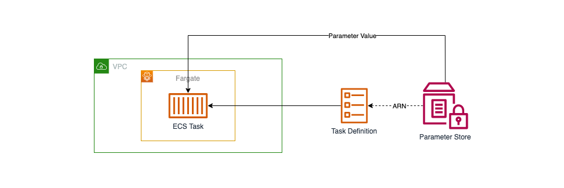
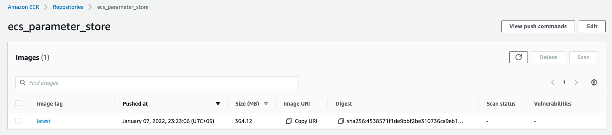
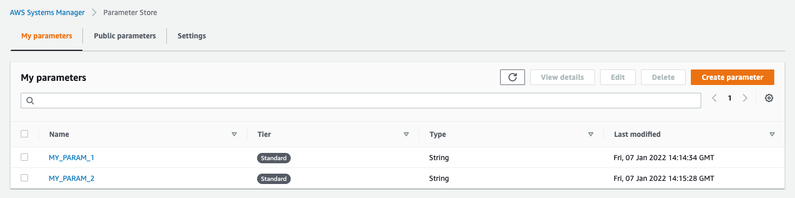
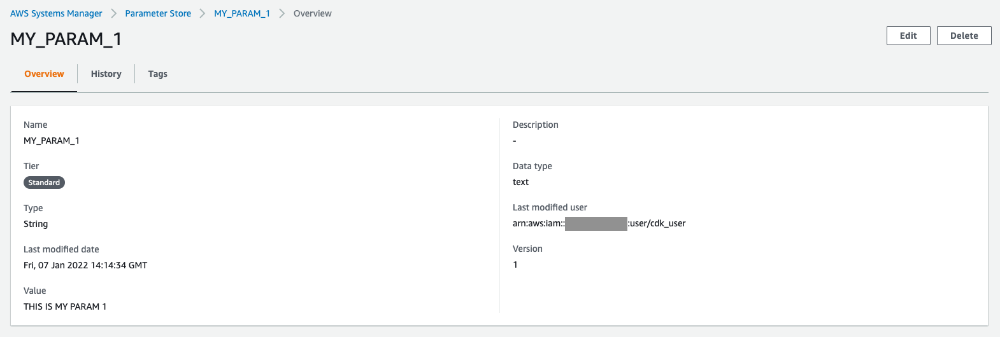
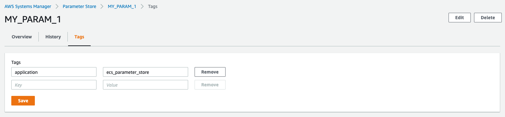
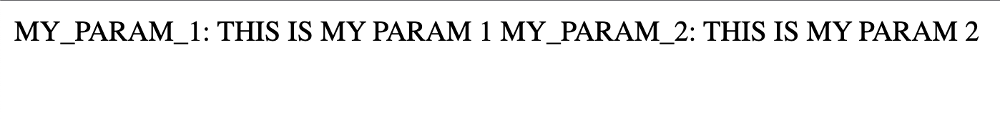

## 作成するシステム構成

ここでは、次のようなシステム構成を構築します。



ECSを使ったアプリケーションに設定するシークレットを、Parameter Storeで管理するシステム構成です。
Task Definitionに参照するParameterの情報を定義し、その定義に基づいてECS Serviceへと環境変数として設定します。

Parameter Storeでシークレットを管理することで、参照できるリソースやユーザーを制限することができます。
なので、パスワードやトークンなど公開したくない情報を隠蔽し、漏洩するリスクを下げることができます。

Secrets Managerを使うことでも、同じ用にシークレットの管理が行なえます。
シークレットのローテーションなどParameter Storeで対応していない機能もあります。
なので、より高度なシークレット管理が必要な場合は、Secrets Managerを検討することとなります。

また、システム構成をコードで管理できるようTerraformを使い構築を進めていきます。
これにより、Production・Developmentといった複数環境に同等の構成を簡単に構築できるようになります。

それでは、順番にシステムの構築を進めていきましょう。


## ネットワーク構築

まずは、VPC・Subnetといったネットワーク部分の構築を進めます。

VPC内に異なるAZとなる２つのPublic Subnetを配置します。
Public SubnetなのでInternetへと通信できるようInternet GatewayをVPCに配置し、Route Tableも設定します。

```tf
terraform {
  required_providers {
    aws = {
      source = "hashicorp/aws"
      version = "~> 3.70.0"
    }
  }
}

locals {
  app_name = "ecs_parameter_store"
}

provider "aws" {
  region = "ap-northeast-1"
  default_tags {
    tags = {
      application = local.app_name
    }
  }
}

data "aws_caller_identity" "this" {}

####################################################
# VPC
####################################################

resource "aws_vpc" "this" {
  cidr_block = "10.0.0.0/16"
  enable_dns_support = true
  enable_dns_hostnames = true
  tags = {
    Name = "${local.app_name}"
  }
}

####################################################
# Public Subnet
####################################################

resource "aws_internet_gateway" "this" {
  vpc_id = aws_vpc.this.id
  tags = {
    Name = "${local.app_name}"
  }
}

resource "aws_subnet" "public_1" {
  vpc_id = aws_vpc.this.id
  cidr_block = "10.0.1.0/24"
  availability_zone = "ap-northeast-1a"
  tags = {
    Name = "${local.app_name}-public_1"
  }
}

resource "aws_subnet" "public_2" {
  vpc_id = aws_vpc.this.id
  cidr_block = "10.0.2.0/24"
  availability_zone = "ap-northeast-1c"
  tags = {
    Name = "${local.app_name}-public_2"
  }
}

resource "aws_route_table" "public" {
  vpc_id = aws_vpc.this.id
  route {
    cidr_block = "0.0.0.0/0"
    gateway_id = aws_internet_gateway.this.id
  }
  tags = {
    Name = "${local.app_name}-public"
  }
}

resource "aws_route_table_association" "public_1_to_ig" {
  subnet_id = aws_subnet.public_1.id
  route_table_id = aws_route_table.public.id
}

resource "aws_route_table_association" "public_2_to_ig" {
  subnet_id = aws_subnet.public_2.id
  route_table_id = aws_route_table.public.id
}
```

これで、ネットワークの構築は完了です。


## セキュリティグループ構築

つぎに、VPC内のアプリケーションに設定するセキュリティグループの構築を進めます。

VPC内の各ECS Service・Taskに共通のセキュリティグループを適用し、同セキュリティグループからの通信を許可することとします。

```tf
####################################################
# Application Security Group
####################################################

resource "aws_security_group" "app" {
  name = "${local.app_name}-app"
  description = "Security Group for Application"
  vpc_id = aws_vpc.this.id
  tags = {
    Name = "${local.app_name}-app"
  }
}

resource "aws_security_group_rule" "app_from_this" {
  security_group_id = aws_security_group.app.id
  type = "ingress"
  description = "Allow from This"
  from_port = 0
  to_port = 0
  protocol = "-1"
  self = true
}

resource "aws_security_group_rule" "app_from_any_http" {
  security_group_id = aws_security_group.app.id
  type = "ingress"
  description = "Allow from Any HTTP"
  from_port = 80
  to_port = 80
  protocol = "tcp"
  cidr_blocks = ["0.0.0.0/0"]
}

resource "aws_security_group_rule" "app_to_any" {
  security_group_id = aws_security_group.app.id
  type = "egress"
  description = "Allow to Any"
  from_port = 0
  to_port = 0
  protocol = "-1"
  cidr_blocks = ["0.0.0.0/0"]
}
```

これで、セキュリティグループの構築は完了です。


## アプリケーション登録

つぎに、シークレット管理の動作確認を行うためのアプリケーションを作成・登録します。

Parameter StoreからECS Serviceへと、環境変数が設定されていることを確認できるアプリケーションを作成します。
ここでは、Node.jsを使ったアプリケーションを作成することとします。

package.json

```json
{
    "name": "myapp",
    "version": "1.0.0",
    "description": "",
    "main": "index.js",
    "scripts": {
      "test": "echo \"Error: no test specified\" && exit 1"
    },
    "author": "",
    "license": "ISC",
    "dependencies": {
      "express": "^4.17.1"
    }
  }
```

index.js

```js
const process = require('process');
const express = require('express');

const app = express();
const port = 80;
const wrap = (fn) => (...args) => fn(...args).catch(args[2]);

app.get('/', wrap(async (req, res) => {
  res.send(
    `MY_PARAM_1: ${process.env.MY_PARAM_1}\n` +
    `MY_PARAM_2: ${process.env.MY_PARAM_2}`
  );
}));
app.listen(port, () => {
  console.log(`Example app listening at http://localhost:${port}`);
});
process.on('SIGINT', () => {
  process.exit(0);
});
```

作成したアプリケーションのDockerイメージを作成します。

Dockerfile

```Dockerfile
FROM public.ecr.aws/docker/library/node:14
WORKDIR /usr/src/app
COPY package*.json ./
RUN npm install
COPY . .
EXPOSE 80
CMD [ "node", "index.js" ]
```

事前にAWSコンソール画面からECR Repositoryを作成し、Dockerイメージを登録します。

```bash
$ ACCOUNT=$(aws sts get-caller-identity | jq -r .Account)
$ REGION=ap-northeast-1
$ aws ecr get-login-password --region ${REGION} | docker login --username AWS --password-stdin ${ACCOUNT}.dkr.ecr.${REGION}.amazonaws.com
$ docker build --tag ${ACCOUNT}.dkr.ecr.${REGION}.amazonaws.com/ecs_parameter_store:latest ./
$ docker push ${ACCOUNT}.dkr.ecr.${REGION}.amazonaws.com/ecs_parameter_store:latest
```




## シークレット登録

つぎに、アプリケーションに設定するシークレットをParameter Storeに登録します。

ここでは、MY_PARAM_1・MY_PARAM_2という名前でParameterを２つ登録します。
このとき、IAMで特定のTagが設定されたParameterのみ参照を許可できるよう、Tagを設定しておきます。








## コンテナサービス構築

最後に、コンテナサービスの構築を進めます。

ECS Serviceとして起動させるDockerイメージは、先程ECR Repositoryに登録したイメージを使います。
このイメージを指定して、ECS Task Difinitionを作成します。

また、Parameter StoreからParameterを参照できるよう、IAMでアクセスを許可し、Task Definitionに参照先を定義します。
IAMでアクセスを許可するParameterは、必要なParameterのみ参照できるよう指定のTagが設定されていることを条件としておきます。

```tf
####################################################
# ECS Cluster
####################################################

resource "aws_ecs_cluster" "this" {
  name = "${local.app_name}"
  capacity_providers = ["FARGATE"]
  default_capacity_provider_strategy {
    capacity_provider = "FARGATE"
  }
  setting {
    name = "containerInsights"
    value = "enabled"
  }
}

resource "aws_iam_role" "ecs_task_exec" {
  name = "${local.app_name}-ecs_task_exec"
  assume_role_policy = jsonencode({
    Version = "2012-10-17"
    Statement = [
      {
        Effect = "Allow"
        Principal = { Service = "ecs-tasks.amazonaws.com" }
        Action = "sts:AssumeRole"
      }
    ]
  })
  managed_policy_arns = [
    "arn:aws:iam::aws:policy/service-role/AmazonECSTaskExecutionRolePolicy"
  ]
  inline_policy {
    name = "allow_parameter_store"
    policy = jsonencode({
      Version = "2012-10-17"
      Statement = [
        {
          Effect = "Allow"
          Action = "ssm:GetParameters"
          Resource = "arn:aws:ssm:ap-northeast-1:${data.aws_caller_identity.this.account_id}:parameter/*"
          Condition = {
            StringEquals: {
              "ssm:resourceTag/application": "${local.app_name}"
            }
          }
        }
      ]
    })
  }
}

####################################################
# ECS Task Definition
####################################################

resource "aws_cloudwatch_log_group" "ecs_service" {
  name = "${local.app_name}-ecs_service"
}

resource "aws_iam_role" "ecs_service" {
  name = "${local.app_name}-ecs_service"
  assume_role_policy = jsonencode({
    Version = "2012-10-17"
    Statement = [
      {
        Effect = "Allow"
        Principal = { Service = "ecs-tasks.amazonaws.com" }
        Action = "sts:AssumeRole"
      }
    ]
  })
  inline_policy {
    name = "allow_logs"
    policy = jsonencode({
      Version = "2012-10-17"
      Statement = [
        {
          Effect = "Allow"
          Action = [
            "logs:CreateLogStream",
            "logs:DescribeLogGroups",
            "logs:DescribeLogStreams",
            "logs:PutLogEvents",
          ],
          Resource = "*"
        }
      ]
    })
  }
}

resource "aws_ecs_task_definition" "ecs_service" {
  family = "${local.app_name}-ecs_service"
  network_mode = "awsvpc"
  requires_compatibilities = ["FARGATE"]
  cpu = 256
  memory = 512
  execution_role_arn = aws_iam_role.ecs_task_exec.arn
  task_role_arn = aws_iam_role.ecs_service.arn
  container_definitions = jsonencode([{
    name = "ecs_service"
    image = "${data.aws_caller_identity.this.account_id}.dkr.ecr.ap-northeast-1.amazonaws.com/${local.app_name}:latest"
    portMappings = [
      { containerPort = 80 }
    ]
    secrets = [
      {
        name = "MY_PARAM_1"
        valueFrom = "arn:aws:ssm:ap-northeast-1:${data.aws_caller_identity.this.account_id}:parameter/MY_PARAM_1"
      },
      {
        name = "MY_PARAM_2"
        valueFrom = "arn:aws:ssm:ap-northeast-1:${data.aws_caller_identity.this.account_id}:parameter/MY_PARAM_2"
      }
    ]
    logConfiguration = {
      logDriver = "awslogs"
      options = {
        awslogs-region = "ap-northeast-1"
        awslogs-group = aws_cloudwatch_log_group.ecs_service.name
        awslogs-stream-prefix = "ecs"
      }
    }
  }])
}

resource "aws_ecs_service" "ecs_service" {
  name = "${local.app_name}-ecs_service"
  cluster = aws_ecs_cluster.this.id
  platform_version = "LATEST"
  task_definition = aws_ecs_task_definition.ecs_service.arn
  desired_count = 1
  deployment_minimum_healthy_percent = 100
  deployment_maximum_percent = 200
  propagate_tags = "SERVICE"
  enable_execute_command = true
  launch_type = "FARGATE"
  deployment_circuit_breaker {
    enable = true
    rollback = true
  }
  network_configuration {
    assign_public_ip = true
    subnets = [
      aws_subnet.public_1.id,
      aws_subnet.public_2.id,
    ]
    security_groups = [
      aws_security_group.app.id,
    ]
  }
}
```

これで、コンテナサービスの構築は完了です。

正しく構築できていれば、アプリケーションのトップ画面にアクセスすると、
Parameter Storeから参照したParameterが環境変数として設定されていることが確認できます。




## まとめ

ECSとParameter Storeを使った、シークレット管理システムを構築しました。

Parameter StoreからECS Serviceへと、Parameterを設定できるようにしました。
これにより内容を隠蔽した形で、シークレット管理できるようになりました。

システムの規模に関わらず、パスワードやトークンをアプリケーションに設定するケースは多々あると思います。
そのような時に、Parameter Storeを使えば、簡単にシークレット管理が行えます。

よりセキュアなシステムを構築できるよう、しっかりと理解しておきましょう。
