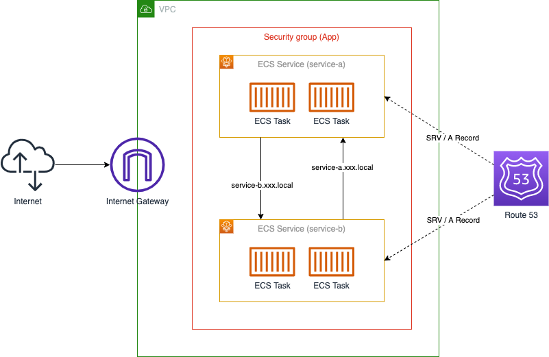
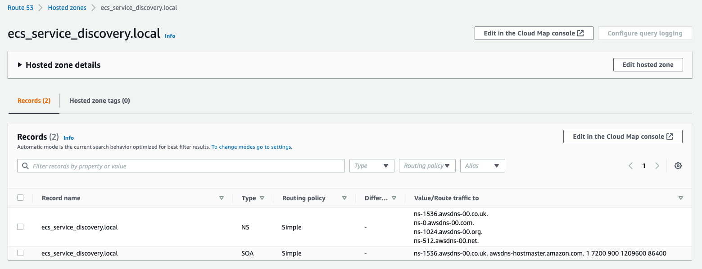
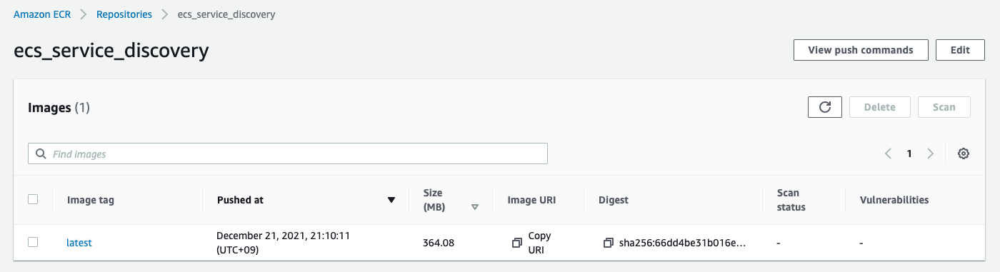
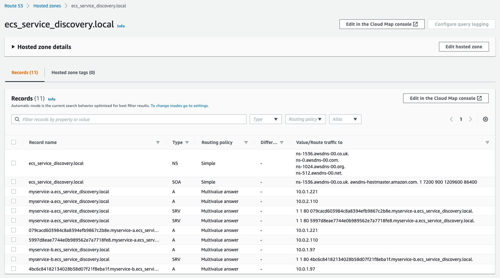

## 作成するシステム構成

ここでは、次のようなシステム構成を構築します。




複数のECS Service間でリクエストを行えるシステム構成です。
ECS Service Discoveryにより、DNS名をもとにECS Serviceに対してリクエストを行えます。

ALBと連携することでも、DNS名をもとにECS Serviceに対してリクエストを行える状況にできます。
ですが、ECS Service Discoveryを使うことにで、より手軽に構築できます。

近年はコンテナ・サーバーレスなどコストをかけずにシステム構成を拡張できるようになりました。
それにより、マイクロサービスを採用したシステム構成が実現しやすくなっています。
そして、ECS Service Discoveryを使うことで、コンテナをベースとしたマイクロサービス構成をより手軽に構築できるようになります。

また、システム構成をコードで管理できるようTerraformを使い構築を進めていきます。
これにより、Production・Developmentといった複数環境に同等の構成を簡単に構築できるようになります。

それでは、順番にシステムの構築を進めていきましょう。


## ネットワーク構築

まずは、VPC・Subnetといったネットワーク部分の構築を進めます。

VPC内に異なるAZとなる２つのPublic Subnetを配置します。
Public SubnetなのでInternetへと通信できるようInternet GatewayをVPCに配置し、Route Tableも設定します。

この時、Service Discoveryを使うので、DNS・DNSホスト名の設定を有効にしておきます。
設定を無効にしたとしてもエラーにはなりませんが、DNS名からリクエストできない状態となるので注意が必要です。

```tf
terraform {
  required_providers {
    aws = {
      source = "hashicorp/aws"
      version = "~> 3.70.0"
    }
  }
}

locals {
  app_name = "ecs_service_discovery"
}

provider "aws" {
  region = "ap-northeast-1"
  default_tags {
    tags = {
      application = local.app_name
    }
  }
}

data "aws_caller_identity" "this" {}

####################################################
# VPC
####################################################

resource "aws_vpc" "this" {
  cidr_block = "10.0.0.0/16"
  enable_dns_support = true
  enable_dns_hostnames = true
  tags = {
    Name = "${local.app_name}"
  }
}

####################################################
# Public Subnet
####################################################

resource "aws_internet_gateway" "this" {
  vpc_id = aws_vpc.this.id
  tags = {
    Name = "${local.app_name}"
  }
}

resource "aws_subnet" "public_1" {
  vpc_id = aws_vpc.this.id
  cidr_block = "10.0.1.0/24"
  availability_zone = "ap-northeast-1a"
  tags = {
    Name = "${local.app_name}-public_1"
  }
}

resource "aws_subnet" "public_2" {
  vpc_id = aws_vpc.this.id
  cidr_block = "10.0.2.0/24"
  availability_zone = "ap-northeast-1c"
  tags = {
    Name = "${local.app_name}-public_2"
  }
}

resource "aws_route_table" "public" {
  vpc_id = aws_vpc.this.id
  route {
    cidr_block = "0.0.0.0/0"
    gateway_id = aws_internet_gateway.this.id
  }
  tags = {
    Name = "${local.app_name}-public"
  }
}

resource "aws_route_table_association" "public_1_to_ig" {
  subnet_id = aws_subnet.public_1.id
  route_table_id = aws_route_table.public.id
}

resource "aws_route_table_association" "public_2_to_ig" {
  subnet_id = aws_subnet.public_2.id
  route_table_id = aws_route_table.public.id
}
```

これで、ネットワークの構築は完了です。


## セキュリティグループ構築

つぎに、VPC内のアプリケーションに設定するセキュリティグループの構築を進めます。

VPC内に複数のECS Serviceを配置し、互いにリクエストを行える状態にする必要があります。
なので、各ECS Serviceに共通のセキュリティグループを適用し、同セキュリティグループからの通信を許可することとします。

また、動作確認ができるようインターネットからのHTTP通信も許可しておきます。
本番の構成では、ALBなどを配置して直接ECS Serviceに通信できない構成が望ましいと思われます。

```tf
####################################################
# Application Security Group
####################################################

resource "aws_security_group" "app" {
  name = "${local.app_name}-app"
  description = "Security Group for Application"
  vpc_id = aws_vpc.this.id
  tags = {
    Name = "${local.app_name}-app"
  }
}

resource "aws_security_group_rule" "app_from_this" {
  security_group_id = aws_security_group.app.id
  type = "ingress"
  description = "Allow from This"
  from_port = 0
  to_port = 0
  protocol = "-1"
  self = true
}

resource "aws_security_group_rule" "app_from_any_http" {
  security_group_id = aws_security_group.app.id
  type = "ingress"
  description = "Allow from Any HTTP"
  from_port = 80
  to_port = 80
  protocol = "tcp"
  cidr_blocks = ["0.0.0.0/0"]
}

resource "aws_security_group_rule" "app_to_any" {
  security_group_id = aws_security_group.app.id
  type = "egress"
  description = "Allow to Any"
  from_port = 0
  to_port = 0
  protocol = "-1"
  cidr_blocks = ["0.0.0.0/0"]
}
```

これで、セキュリティグループの構築は完了です。


## Hosted Zone 構築

つぎに、Hosted Zoneの構築を進めます。

ECS Service Discoveryとは、Route53にコンテナのIPに対応するレコードを登録する仕組みです。
ここでは、Service Discoveryで使用するドメイン名に対応する、Hosted Zoneを作成します。

```tf
##################################################
# Hosted Zone
##################################################

resource "aws_service_discovery_private_dns_namespace" "this" {
  name = "${local.app_name}.local"
  description = "${local.app_name}"
  vpc = aws_vpc.this.id
}
```



これで、Hosted Zoneの構築は完了です。


## アプリケーション登録

つぎに、ECS Service Discoveryの動作確認を行うためのアプリケーションを作成・登録します。

ECS Service Discoveryで、各ECS Serviceへリクエストが送れていることを確認できるアプリケーションを作成します。
ここでは、Node.jsを使ったアプリケーションを作成することとします。

作成する2つのECS Serviceに対してリクエストを送り、レスポンスを簡易的に表示できるものです。
また、ECS Service自身のService名は、環境変数（`SERVICE_NAME`）として渡すこととします。

package.json

```json
{
    "name": "myservice",
    "version": "1.0.0",
    "description": "",
    "main": "index.js",
    "scripts": {
      "test": "echo \"Error: no test specified\" && exit 1"
    },
    "author": "",
    "license": "ISC",
    "dependencies": {
      "axios": "^0.24.0",
      "express": "^4.17.1"
    }
  }
```

index.js

```js
const process = require('process');
const express = require('express');
const axios = require('axios');

const app = express();
const port = 80;
const wrap = (fn) => (...args) => fn(...args).catch(args[2]);

app.get('/', wrap(async (req, res) => {
  res.send('HELLO WORLD!!');
}));
app.get('/request', wrap(async (req, res) => {
  const resA = await axios.get('http://myservice-a.ecs_service_discovery.local/message');
  const resB = await axios.get('http://myservice-b.ecs_service_discovery.local/message');
  res.json({
    serviceA: resA.data.message,
    serviceB: resB.data.message,
  });
}));
app.get('/message', wrap(async (req, res) => {
  res.json({ message: `THIS IS ${process.env.SERVICE_NAME}!!` });
}));
app.use((err, req, res, next) => {
  if (err) {
    res.status(500);
    res.send(err.toString());
  } else {
    res.send('OK');
  }
});
app.listen(port, () => {
  console.log(`Example app listening at http://localhost:${port}`);
});
process.on('SIGINT', () => {
  process.exit(0);
});
```

作成したアプリケーションのDockerイメージを作成します。

Dockerfile

```Dockerfile
# Dockerfile
FROM public.ecr.aws/docker/library/node:14
WORKDIR /usr/src/app
COPY package*.json ./
RUN npm install
COPY . .
EXPOSE 80
CMD [ "node", "index.js" ]
```

事前にAWSコンソール画面からECR Repositoryを作成し、Dockerイメージを登録します。

```bash
$ ACCOUNT=$(aws sts get-caller-identity | jq -r .Account)
$ REGION=ap-northeast-1
$ aws ecr get-login-password --region ${REGION} | docker login --username AWS --password-stdin ${ACCOUNT}.dkr.ecr.${REGION}.amazonaws.com
$ docker build --tag ${ACCOUNT}.dkr.ecr.${REGION}.amazonaws.com/ecs_service_discovery:latest ./
$ docker push ${ACCOUNT}.dkr.ecr.${REGION}.amazonaws.com/ecs_service_discovery:latest
```




## コンテナサービス構築

最後に、コンテナサービスの構築を進めます。

ECS Serviceとして起動させるDockerイメージは、先程ECR Repositoryに登録したイメージを使います。
このイメージを指定して、ECS Task Difinitionを作成します。

ここでは、ECS Service Discoveryを使うため、各ECS Serviceに対応するDNSレコードが作成されるようにします。
ECS Serviceは２つ作成し、DNS名を`myservice-a.{app_name}.local`・`myservice-b.{app_name}.local`とします。

```tf
####################################################
# ECS Cluster
####################################################

resource "aws_ecs_cluster" "this" {
  name = "${local.app_name}"
  capacity_providers = ["FARGATE"]
  default_capacity_provider_strategy {
    capacity_provider = "FARGATE"
  }
  setting {
    name = "containerInsights"
    value = "enabled"
  }
}

resource "aws_iam_role" "ecs_task_exec" {
  name = "${local.app_name}-ecs_task_exec"
  assume_role_policy = jsonencode({
    Version = "2012-10-17"
    Statement = [
      {
        Effect = "Allow"
        Principal = { Service = "ecs-tasks.amazonaws.com" }
        Action = "sts:AssumeRole"
      }
    ]
  })
  managed_policy_arns = [
    "arn:aws:iam::aws:policy/service-role/AmazonECSTaskExecutionRolePolicy"
  ]
}

####################################################
# ECS Task Definition
####################################################

resource "aws_cloudwatch_log_group" "myservice" {
  name = "${local.app_name}-myservice"
}

resource "aws_iam_role" "myservice_task" {
  name = "${local.app_name}-myservice_task"
  assume_role_policy = jsonencode({
    Version = "2012-10-17"
    Statement = [
      {
        Effect = "Allow"
        Principal = { Service = "ecs-tasks.amazonaws.com" }
        Action = "sts:AssumeRole"
      }
    ]
  })
  inline_policy {
    name = "allow_logs"
    policy = jsonencode({
      Version = "2012-10-17"
      Statement = [
        {
          Effect = "Allow"
          Action = [
            "logs:CreateLogStream",
            "logs:DescribeLogGroups",
            "logs:DescribeLogStreams",
            "logs:PutLogEvents",
          ],
          Resource = "*"
        }
      ]
    })
  }
}

resource "aws_ecs_task_definition" "myservice" {
  for_each = toset(["a", "b"])
  family = "${local.app_name}-myservice-${each.key}"
  network_mode = "awsvpc"
  requires_compatibilities = ["FARGATE"]
  cpu = 256
  memory = 512
  execution_role_arn = aws_iam_role.ecs_task_exec.arn
  task_role_arn = aws_iam_role.myservice_task.arn
  container_definitions = jsonencode([{
    name = "myservice"
    image = "${data.aws_caller_identity.this.account_id}.dkr.ecr.ap-northeast-1.amazonaws.com/${local.app_name}:latest"
    portMappings = [{ containerPort:80 }]
      environment = [
        { name = "SERVICE_NAME", value = "myservice-${each.key}" },
      ]
    logConfiguration = {
      logDriver = "awslogs"
      options = {
        awslogs-region: "ap-northeast-1"
        awslogs-group: aws_cloudwatch_log_group.myservice.name
        awslogs-stream-prefix: "ecs"
      }
    }
  }])
}

resource "aws_service_discovery_service" "myservice" {
  for_each = toset(["a", "b"])
  name = "myservice-${each.key}"
  dns_config {
    namespace_id = aws_service_discovery_private_dns_namespace.this.id
    routing_policy = "MULTIVALUE"
    dns_records {
      ttl = 10
      type = "A"
    }
    dns_records {
      ttl = 10
      type = "SRV"
    }
  }
  health_check_custom_config {
    failure_threshold = 1
  }
}

resource "aws_ecs_service" "myservice" {
  for_each = toset(["a", "b"])
  name = "${local.app_name}-myservice-${each.key}"
  cluster = aws_ecs_cluster.this.id
  platform_version = "LATEST"
  task_definition = aws_ecs_task_definition.myservice[each.key].arn
  desired_count = 2
  deployment_minimum_healthy_percent = 100
  deployment_maximum_percent = 200
  propagate_tags = "SERVICE"
  enable_execute_command = true
  launch_type = "FARGATE"
  deployment_circuit_breaker {
    enable = true
    rollback = true
  }
  network_configuration {
    assign_public_ip = true
    subnets = [
      aws_subnet.public_1.id,
      aws_subnet.public_2.id,
    ]
    security_groups = [
      aws_security_group.app.id,
    ]
  }
  service_registries {
    registry_arn = aws_service_discovery_service.myservice[each.key].arn
    port = 80
  }
}
```

これで、コンテナサービスの構築は完了です。
正しく構築できていれば、Hosted Zoneにレコードが追加され、各Serviceと連携できていることが確認できます。



作成したECS TaskのIPアドレスを確認し、curlなどでリクエストを送るとメッセージが取得できていることが確認できます。

```bash
$ curl -s http://54.248.5.165/request | jq .
{
  "serviceA": "THIS IS myservice-a!!",
  "serviceB": "THIS IS myservice-b!!"
}
```


## まとめ

ECS Service Discoveryを使った、ECS Service間連携システムを構築しました。

ECS Serviceに対応するDNSレコードを作成することで、DNS名からECS Serviceに対してリクエストを送れるようにしました。
これにより、簡単にECS Service間で連携できるようになりました。

システムの規模が大きくなるにつれて、マイクロサービス化する場合は少なくないと思います。
そのような時に、ECS Service Discoveryを使えば、簡単にマイクロサービス間で連携する基盤が構築できるようになります。

より手軽に大規模なシステムを構築できるよう、しっかりと理解しておきましょう。
